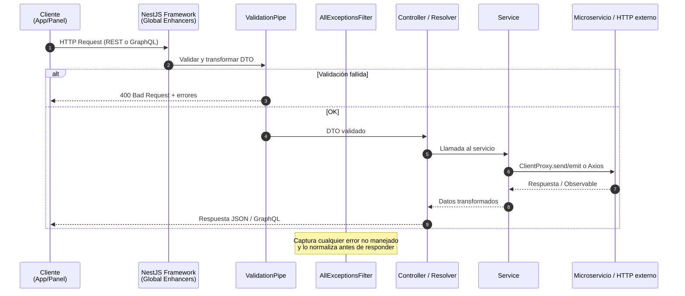
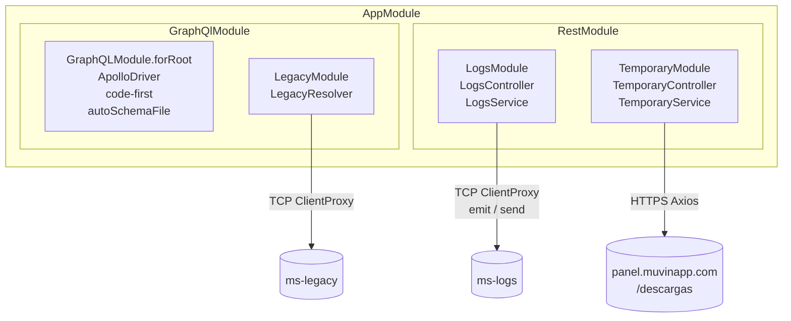

# Arquitectura General — muvin-api

> **Última revisión:** 2026-04-29

---

## Flujo de request completo



---

## Estructura de módulos



---

## Capas de la aplicación

| Capa | Archivos | Responsabilidad |
|------|---------|----------------|
| **Entry point** | `main.ts` | Bootstrap, pipes globales, filtros, interceptores |
| **Root Module** | `module.ts` | Composición de GraphQlModule + RestModule |
| **Module layer** | `modules/*/module.ts` | Registro de controladores, servicios, clientes TCP |
| **Controller/Resolver** | `*/controller.ts`, `*/resolver.ts` | Routing HTTP/GraphQL, recepción de DTOs |
| **Service layer** | `*/service.ts` | Lógica de orquestación, llamadas a microservicios |
| **Core** | `core/` | Filtros, interceptores, caché, DTOs compartidos |
| **Common** | `common/` | Funciones utilitarias, enums, CMDs, interfaces |
| **Contracts** | `contracts/` | Tipos compartidos con microservicios (ms-legacy, ms-logs) |
| **Config** | `config/` | Variables de entorno tipadas |

---

## Enhancers globales

| Enhancer | Tipo | Descripción |
|----------|------|-------------|
| `ValidationPipe` | Pipe | Valida y transforma DTOs (class-validator). `whitelist: true`, `forbidNonWhitelisted: true` |
| `AllExceptionsFilter` | Filter | Captura toda excepción no manejada y retorna respuesta estandarizada |
| `GraphqlLoggingInterceptor` | Interceptor | Registra operaciones GraphQL (queries, mutations) |

---

## Límites de payload

Configurados en `main.ts`:

```typescript
app.use(json({ limit: '50mb' }));
app.use(urlencoded({ limit: '50mb', extended: true }));
```

> Fueron aumentados de 1 MB a 50 MB, probablemente para soportar el módulo de descargas.

---

## Referencias

- [[vision-general]]
- [[stack-tecnologico]]
- [[_indice-modulos]]
