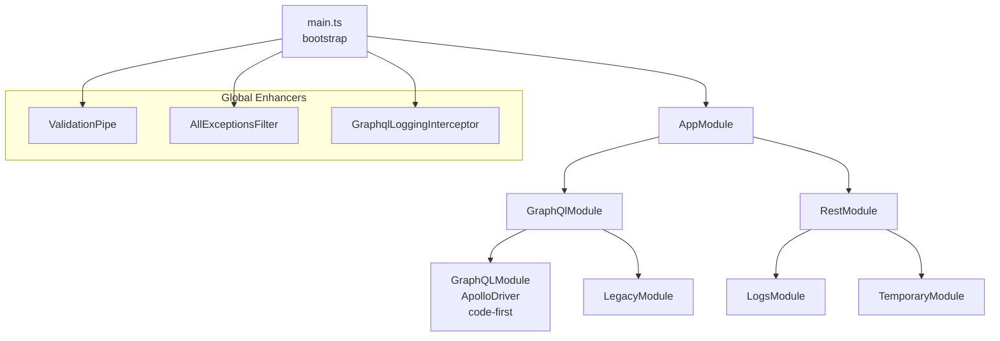
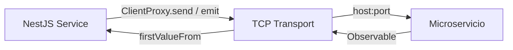

# Stack Tecnológico — muvin-api

> **Última revisión:** 2026-04-29

---

## Tecnologías principales

| Tecnología | Versión | Rol |
|-----------|---------|-----|
| **Node.js** | ≥ 18 | Runtime |
| **TypeScript** | 5.x | Lenguaje |
| **NestJS** | ^11.0.1 | Framework principal |
| **Apollo Server** | ^4.12.2 | Servidor GraphQL |
| **Express** | 5.x | HTTP adapter (via @nestjs/platform-express) |
| **Axios** | ^1.13.2 | Cliente HTTP (módulo temporary) |
| **RxJS** | ^7.8.1 | Programación reactiva (microservicios) |
| **class-validator** | ^0.14.2 | Validación de DTOs |
| **class-transformer** | ^0.5.1 | Transformación de objetos |
| **Joi** | ^18.0.1 | Validación de variables de entorno |
| **uuid** | ^13.0.0 | Generación de IDs |

---

## Módulos NestJS clave

| Paquete | Versión | Uso |
|---------|---------|-----|
| `@nestjs/graphql` | ^13.1.0 | Decoradores GraphQL (code-first) |
| `@nestjs/apollo` | ^13.1.0 | Driver Apollo para NestJS |
| `@nestjs/microservices` | ^11.1.6 | Comunicación TCP con microservicios |
| `@nestjs/axios` | ^4.0.1 | HttpModule (Axios wrapper) |
| `@nestjs/config` | ^4.0.2 | Gestión de configuración/entornos |

---

## Arquitectura NestJS

---

## Patrón de comunicación con microservicios

- **`send()`** → petición con respuesta (request-response)
- **`emit()`** → fire-and-forget (para logs: create, update)

---

## Variables de entorno requeridas

| Variable | Descripción |
|----------|-------------|
| `PORT` | Puerto del servidor HTTP |
| `LEGACY_MICROSERVICE_HOST` | Host de ms-legacy |
| `LEGACY_MICROSERVICE_PORT` | Puerto de ms-legacy |
| `LEGACY_MICROSERVICE_TRANSPORT` | Transporte (TCP) |
| `LEGACY_MICROSERVICE_SERVICE` | Nombre del servicio |
| `LOGS_MICROSERVICE_HOST` | Host de ms-logs |
| `LOGS_MICROSERVICE_PORT` | Puerto de ms-logs |
| `LOGS_MICROSERVICE_TRANSPORT` | Transporte (TCP) |
| `LOGS_MICROSERVICE_SERVICE` | Nombre del servicio |

> ⚠️ El módulo `temporary` tiene credenciales **hardcodeadas** en `configuration.ts` (ver [[deuda-tecnica]]).

---

## DevDependencies relevantes

| Paquete | Uso |
|---------|-----|
| `@nestjs/testing` | Infraestructura de tests |
| `jest` ^30 | Test runner |
| `husky` | Git hooks |
| `eslint` + `prettier` | Linting y formato |
