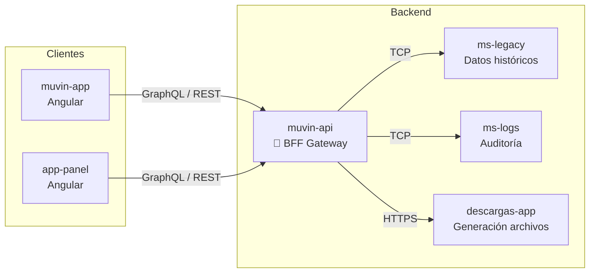

# Visión General — muvin-api

> **Última revisión:** 2026-04-29

---

## Propósito

`muvin-api` es la **puerta de entrada** a la plataforma Muvin. Su responsabilidad principal es:

1. **Autenticar y validar** las peticiones entrantes de los clientes web
2. **Enrutar** hacia los microservicios internos apropiados
3. **Transformar** las respuestas al formato esperado por los clientes
4. **Registrar** logs de auditoría para toda la plataforma

No contiene lógica de negocio propia: es un **orquestador y proxy**.

---

## Posición en el ecosistema

---

## Responsabilidades

| Responsabilidad | Implementación |
|----------------|----------------|
| Validación de payloads | `ValidationPipe` global (class-validator) |
| Manejo de errores | `AllExceptionsFilter` global |
| Logging de operaciones | `GraphqlLoggingInterceptor` global |
| Comunicación con microservicios | `ClientProxy` (@nestjs/microservices, TCP) |
| Proxy HTTP externo | `HttpService` (Axios) |

---

## Contexto del nombre "Temporary"

El módulo `TemporaryModule` (prefijo `/descargas`) es un **proxy temporal** hacia `descargas-app`. El nombre implica que eventualmente esta responsabilidad debería moverse a su propio microservicio o integrarse de otra forma. Actualmente es funcional en producción.

---

## Alcance actual

| Funcionalidad | Estado |
|--------------|--------|
| Query GraphQL compradores (ms-legacy) | ✅ Activo |
| CRUD logs de auditoría (ms-logs) | ✅ Activo |
| Proxy descargas | ✅ Activo (temporal) |
| Autenticación propia | ❌ No implementada (delegada a otros servicios) |
| Swagger/OpenAPI | ❌ No configurado |
| Tests automatizados | ⚠️ Infraestructura lista, sin tests escritos |
