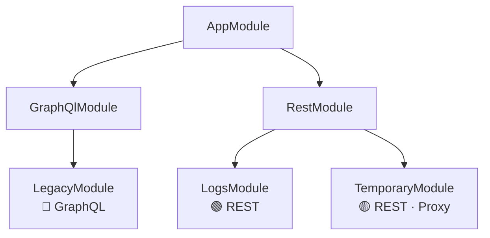

# Índice de Módulos — muvin-api

> **Última revisión:** 2026-04-29

---

## Mapa de módulos

---

## Tabla de módulos

| Módulo | Protocolo | Estado | Criticidad | Descripción |
|--------|-----------|--------|------------|-------------|
| [[modulo-legacy]] | GraphQL | 🟢 Activo | 🟡 Media | Query de compradores hacia ms-legacy |
| [[modulo-logs]] | REST | 🟢 Activo | 🔴 Alta | Auditoría de toda la plataforma |
| [[modulo-temporary]] | REST | 🟡 Temporal | 🟡 Media | Proxy hacia descargas-app |
