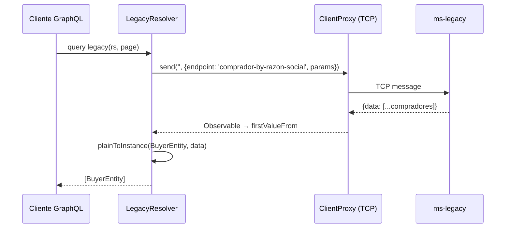

# Módulo: Legacy (GraphQL)

> **Archivo:** `src/modules/legacy/module.ts`
> **Protocolo:** GraphQL
> **Criticidad:** 🟡 Media
> **Estado:** 🟢 Activo

---

## Propósito

Expone una query GraphQL para consultar **compradores** del sistema legado de Muvin. Actúa como proxy hacia el microservicio `ms-legacy` vía TCP.

---

## Componentes

| Archivo | Tipo | Descripción |
|---------|------|-------------|
| `module.ts` | Module | Registra `LegacyResolver` y el `ClientProxy` TCP hacia ms-legacy |
| `resolver.ts` | Resolver | Define la query GraphQL `legacy(rs, page)` |
| `entities/buyer.entity.ts` | ObjectType | Entidad GraphQL `BuyerEntity` |

---

## Query GraphQL

```graphql
query {
  legacy(rs: "Empresa SA", page: 1) {
    id
    rs
    cuit
  }
}
```

**Argumentos:**

| Argumento | Tipo | Requerido | Descripción |
|-----------|------|-----------|-------------|
| `rs` | String | Sí | Razón social del comprador a buscar |
| `page` | Int | No (default: 1) | Número de página |

**Respuesta:** `[BuyerEntity]`

---

## Flujo interno



---

## Entidad BuyerEntity

```typescript
@ObjectType()
class BuyerEntity {
  @Field(() => Int)   id: number;
  @Field(() => String) rs: string;
  @Field(() => String) cuit: string;
}
```

---

## Configuración de microservicio

```typescript
// environments requeridas:
LEGACY_MICROSERVICE_HOST      // host de ms-legacy
LEGACY_MICROSERVICE_PORT      // puerto TCP
LEGACY_MICROSERVICE_TRANSPORT // TCP
LEGACY_MICROSERVICE_SERVICE   // nombre del token de inyección
```

---

## Dependencias

| Dependencia | Tipo | Descripción |
|-------------|------|-------------|
| `@contract-ms-legacy` | Path alias | Tipos del contrato con ms-legacy (`IRequests`) |
| `@nestjs/microservices` | NestJS | `ClientProxy`, transporte TCP |
| `@core` | Interno | `MICROSERVICE_INTERCEPTOR` factory |

---

## Referencias

- [[_indice-modulos]]
- [[f01-legacy-query]]
- [[graphql-endpoints]]
