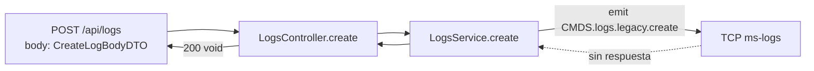

# Módulo: Logs (REST)

> **Archivo:** `src/modules/logs/module.ts`
> **Protocolo:** REST — prefijo `/logs`
> **Criticidad:** 🔴 Alta
> **Estado:** 🟢 Activo

---

## Propósito

Expone endpoints REST para **crear, actualizar y consultar logs de auditoría** de toda la plataforma Muvin. Actúa como proxy hacia el microservicio `ms-logs` vía TCP.

Los patrones de comunicación son:
- **`emit()`** para create/update (fire-and-forget — no bloquea al cliente)
- **`send()`** para search (request-response — retorna datos)

---

## Componentes

| Archivo | Tipo | Descripción |
|---------|------|-------------|
| `module.ts` | Module | Registra `ClientsModule` TCP hacia ms-logs |
| `controller.ts` | Controller | 5 endpoints REST |
| `service.ts` | Service | Orquesta llamadas a ms-logs via `ClientProxy` |
| `dtos/` | DTOs | Validación de body/query para cada endpoint |

---

## Endpoints

| Método | Ruta | Descripción | Patrón |
|--------|------|-------------|--------|
| POST | `/api/logs` | Crear log | `emit` (fire-and-forget) |
| PUT | `/api/logs` | Actualizar log | `emit` (fire-and-forget) |
| GET | `/api/logs/by-id` | Buscar por ID | `send` (con respuesta) |
| GET | `/api/logs/by-user` | Buscar por usuario | `send` (con respuesta) |
| GET | `/api/logs/by-terms` | Buscar por términos | `send` (con respuesta) |

---

## DTOs

| DTO | Endpoint | Descripción |
|-----|----------|-------------|
| `CreateLogBodyDTO` | POST | Campos requeridos para crear un log |
| `UpdateLogBodyDTO` | PUT | Campos para actualizar un log existente |
| `SearchIDLogQueryDTO` | GET /by-id | Query param: ID del log |
| `SearchUserLogQueryDTO` | GET /by-user | Query param: identificador de usuario |
| `SearchTermsLogQueryDTO` | GET /by-terms | Query params: términos de búsqueda |

---

## Flujo crear log



---

## Flujo buscar log

```mermaid
flowchart LR
    A[GET /api/logs/by-id\nquery: SearchIDLogQueryDTO] --> B[LogsController.searchId]
    B --> C[LogsService.searchId]
    C -->|send CMDS.logs.legacy.search.id| D[TCP ms-logs]
    D -->|Observable TLogLegacy| C
    C -->|Observable| B
    B -->|TLogLegacy | null| A
```

---

## Configuración de microservicio

```typescript
// environments requeridas:
LOGS_MICROSERVICE_HOST
LOGS_MICROSERVICE_PORT
LOGS_MICROSERVICE_TRANSPORT  // TCP
LOGS_MICROSERVICE_SERVICE
```

---

## Dependencias

| Dependencia | Tipo | Descripción |
|-------------|------|-------------|
| `@contract-ms-logs` | Path alias | Tipos `TContractMsLogs`, `TLogLegacy` |
| `@common` | Interno | `CMDS.logs.legacy.*` — nombres de mensajes |
| `@nestjs/microservices` | NestJS | `ClientProxy`, `ClientsModule` |

---

## Referencias

- [[_indice-modulos]]
- [[f02-logs-crud]]
- [[rest-endpoints]]
