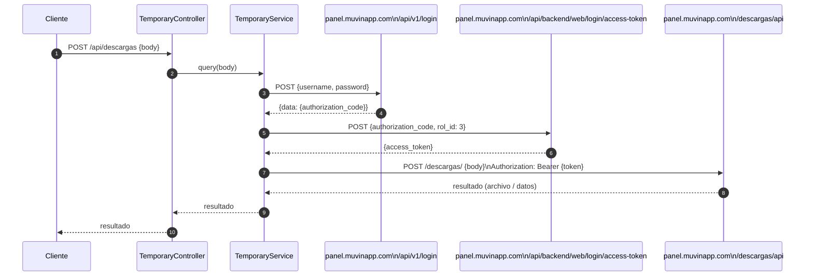

# Módulo: Temporary / Descargas (REST)

> **Archivo:** `src/modules/temporary/module.ts`
> **Protocolo:** REST — prefijo `/descargas`
> **Criticidad:** 🟡 Media
> **Estado:** 🟡 Activo (solución temporal)

---

## Propósito

Actúa como **proxy HTTP** hacia la aplicación `descargas-app` alojada en `panel.muvinapp.com/descargas`. El módulo:

1. Recibe un body arbitrario del cliente
2. Obtiene un token de acceso autenticándose contra `panel.muvinapp.com`
3. Reenvía el body hacia `descargas-app` con el token
4. Retorna la respuesta al cliente

> ⚠️ El nombre "Temporary" indica que esta integración es provisional. Las credenciales y URLs están **hardcodeadas** en `configuration.ts`.

---

## Componentes

| Archivo | Tipo | Descripción |
|---------|------|-------------|
| `module.ts` | Module | Registra `HttpModule` (Axios, sin timeout, 100 MB) |
| `controller.ts` | Controller | Un único endpoint `POST /descargas` |
| `service.ts` | Service | Lógica de autenticación + proxy |
| `configuration.ts` | Config | URLs y credenciales hardcodeadas ⚠️ |
| `interfaces.ts` | Interfaces | Tipos para payloads de login/access |

---

## Flujo completo



---

## Configuración hardcodeada (⚠️ riesgo)

Archivo `configuration.ts`:

```typescript
const AROUND: TAround = 'panel';  // 'dev' | 'cap' | 'panel'
const BASE_URL = `https://panel.muvinapp.com`;

export const CONFIGURATION = {
  URL_LOGIN:    `${BASE_URL}/api/v1/login`,
  URL_ACCESS:   `${BASE_URL}/api/backend/web/login/access-token`,
  URL_DESCARGAS:`${BASE_URL}/descargas/api`,
  ROL_ID:       3,
  USER:         `30556991835`,
  PASSWORD:     `Muvin2021*`,   // ⚠️ Credencial en código fuente
};
```

> 🔴 Las credenciales `USER` y `PASSWORD` están en texto plano en el repositorio. Deben migrarse a variables de entorno.

---

## Configuración del HttpModule

```typescript
HttpModule.register({
  timeout: 0,              // Sin timeout ⚠️
  maxBodyLength: 100 MB,
  maxContentLength: 100 MB,
})
```

> ⚠️ Sin timeout configurado: una llamada a descargas-app podría bloquear indefinidamente.

---

## Manejo de errores

`TemporaryService` implementa `_throwExternalError()` que convierte errores Axios en `HttpException` de NestJS, propagando el status code y el body del servicio externo.

---

## Dependencias

| Dependencia | Uso |
|-------------|-----|
| `@nestjs/axios` | HttpModule + HttpService |
| `axios` | Cliente HTTP directo |

---

## Referencias

- [[_indice-modulos]]
- [[f03-descargas-proxy]]
- [[deuda-tecnica]]
