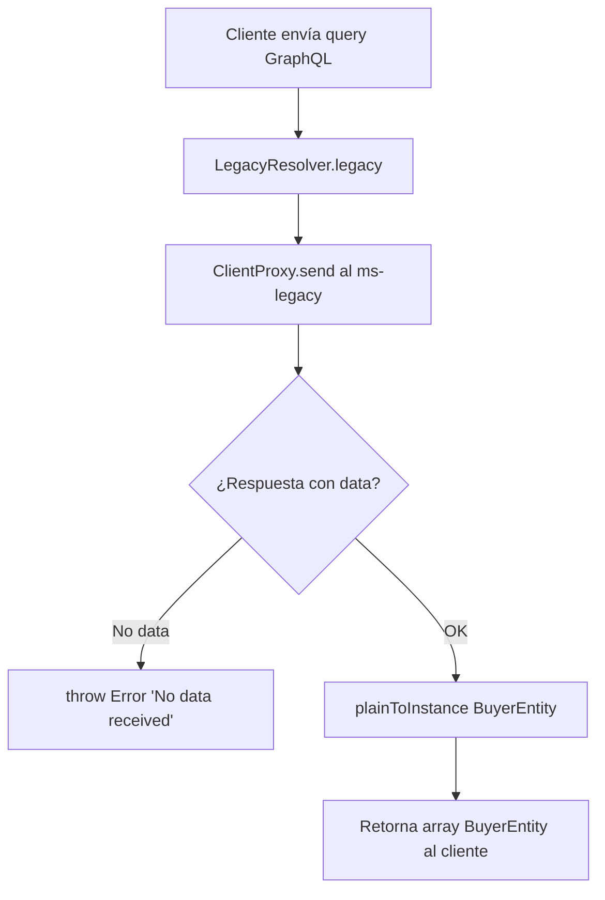

# F-01: Consulta de compradores por razón social

> **Módulo:** legacy
> **Protocolo:** GraphQL
> **Criticidad:** 🟡 Media

---

## Descripción

Permite buscar compradores registrados en el sistema legado de Muvin filtrando por razón social. Los resultados son paginados.

---

## Precondiciones

- El microservicio `ms-legacy` debe estar disponible en TCP
- Variables de entorno `LEGACY_MICROSERVICE_*` configuradas

---

## Query GraphQL

```graphql
query BuscarComprador($rs: String!, $page: Int) {
  legacy(rs: $rs, page: $page) {
    id
    rs
    cuit
  }
}
```

**Variables:**
```json
{
  "rs": "Empresa SA",
  "page": 1
}
```

---

## Flujo



---

## Respuesta exitosa

```json
{
  "data": {
    "legacy": [
      { "id": 1, "rs": "Empresa SA", "cuit": "20-12345678-9" },
      { "id": 2, "rs": "Empresa SRL", "cuit": "30-87654321-0" }
    ]
  }
}
```

---

## Errores posibles

| Escenario | Resultado |
|-----------|-----------|
| ms-legacy no disponible | Error 500 (AllExceptionsFilter) |
| Sin resultados (`data` null) | Error: "No data received" |

---

## Referencias

- [[modulo-legacy]]
- [[graphql-endpoints]]
