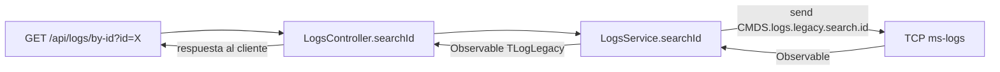

# F-02: CRUD de logs de auditoría

> **Módulo:** logs
> **Protocolo:** REST
> **Criticidad:** 🔴 Alta

---

## Descripción

Permite a cualquier servicio de la plataforma **registrar y consultar logs de auditoría**. El módulo actúa como proxy hacia `ms-logs` via TCP.

---

## Endpoints

### POST `/api/logs` — Crear log

**Body:** `CreateLogBodyDTO`

```json
{
  "userId": "uuid-del-usuario",
  "action": "CREATE_ORDER",
  "entity": "order",
  "entityId": "123",
  "metadata": {}
}
```

> Usa `emit()` — respuesta inmediata `void` sin esperar confirmación de ms-logs.

---

### PUT `/api/logs` — Actualizar log

**Body:** `UpdateLogBodyDTO`

> Usa `emit()` — fire-and-forget.

---

### GET `/api/logs/by-id` — Buscar por ID

**Query params:** `SearchIDLogQueryDTO`

| Param | Tipo | Descripción |
|-------|------|-------------|
| `id` | string | ID del log |

**Response:** `TLogLegacy | null`

---

### GET `/api/logs/by-user` — Buscar por usuario

**Query params:** `SearchUserLogQueryDTO`

| Param | Tipo | Descripción |
|-------|------|-------------|
| `userId` | string | ID del usuario |

---

### GET `/api/logs/by-terms` — Buscar por términos

**Query params:** `SearchTermsLogQueryDTO`

---

## Diagrama de flujo (búsqueda)



---

## Manejo de errores

Todos los endpoints tienen un bloque `try/catch` que loguea el error con `LOG()` y retorna `undefined` en lugar de propagar el error al cliente. Esto significa que un fallo en ms-logs **no genera error HTTP** al llamante.

> ⚠️ Este comportamiento puede ocultar fallos silenciosos.

---

## Referencias

- [[modulo-logs]]
- [[rest-endpoints]]
