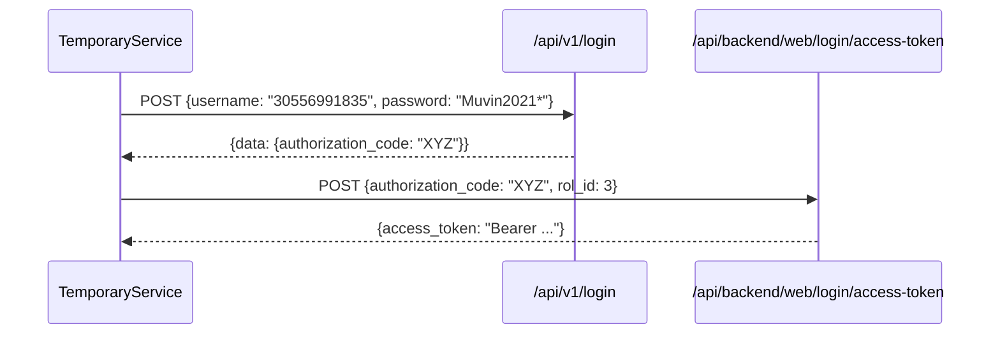
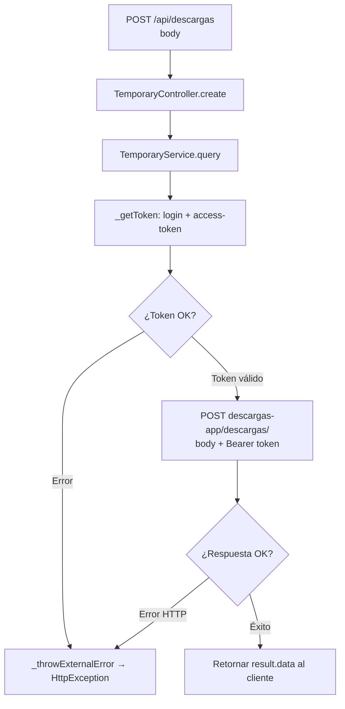

# F-03: Proxy de descargas

> **Módulo:** temporary
> **Protocolo:** REST
> **Criticidad:** 🟡 Media

---

## Descripción

Permite a los clientes solicitar la generación o descarga de archivos a través de `descargas-app`. muvin-api actúa como intermediario autenticado: obtiene un token, lo adjunta al request y reenvía el body original a la aplicación de descargas.

---

## Endpoint

### POST `/api/descargas`

**Body:** `unknown` — se reenvía tal cual a `descargas-app`

**Response:** Datos / archivo retornado por `descargas-app`

---

## Flujo de autenticación de dos pasos

> ⚠️ Este doble paso de autenticación (login → access-token) ocurre **en cada request**. No hay caché del token.

---

## Flujo completo

---

## Comportamiento ante errores

`_throwExternalError()` inspecciona el error Axios y:
- Si tiene `response.data` y `response.status` → lanza `HttpException(data, status)` — propaga el error del servicio externo
- En cualquier otro caso → lanza `HttpException({message: 'External service unavailable'}, 502)`

---

## Advertencias

| Ítem | Riesgo |
|------|--------|
| Credenciales hardcodeadas | 🔴 Crítico — USER/PASSWORD en texto plano en código |
| Sin caché de token | 🟡 Performance — 2 requests HTTP por cada solicitud |
| Sin timeout | 🟡 Riesgo — puede bloquear indefinidamente |
| `AROUND = 'panel'` | 🟡 — Apunta siempre a prod; no hay forma de cambiar entorno sin recompilar |

---

## Referencias

- [[modulo-temporary]]
- [[deuda-tecnica]]
