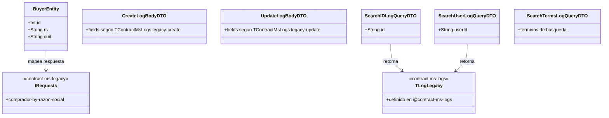

# Modelo de Datos — muvin-api

> **Última revisión:** 2026-04-29

---

## Descripción

`muvin-api` es un **API Gateway / BFF** y **no gestiona base de datos propia**. No tiene ORM, ni migraciones, ni entidades de persistencia.

Su "modelo de datos" está definido por:

1. **DTOs** — formas de entrada/salida validadas con `class-validator`
2. **Entidades GraphQL** — `@ObjectType` para el schema GraphQL
3. **Contratos con microservicios** — tipos TypeScript compartidos vía path aliases

---

## Diagrama de tipos

---

## Entidades GraphQL

### BuyerEntity

**Archivo:** `modules/legacy/entities/buyer.entity.ts`

| Campo | Tipo GraphQL | Tipo TS | Descripción |
|-------|-------------|---------|-------------|
| `id` | `Int!` | `number` | ID del comprador en ms-legacy |
| `rs` | `String!` | `string` | Razón social |
| `cuit` | `String!` | `string` | CUIT del comprador |

---

## DTOs REST

### Módulo Logs

| DTO | Endpoint | Campos |
|-----|----------|--------|
| `CreateLogBodyDTO` | POST `/api/logs` | Definidos por `TContractMsLogs['legacy-create']` |
| `UpdateLogBodyDTO` | PUT `/api/logs` | Definidos por `TContractMsLogs['legacy-update']` |
| `SearchIDLogQueryDTO` | GET `/api/logs/by-id` | `id: string` |
| `SearchUserLogQueryDTO` | GET `/api/logs/by-user` | `userId: string` |
| `SearchTermsLogQueryDTO` | GET `/api/logs/by-terms` | Términos de búsqueda |

### Módulo Temporary

| Elemento | Descripción |
|----------|-------------|
| `ILoginPayload` | `{ username: string, password: string }` |
| `ILoginResponse` | `{ data: { authorization_code: string } }` |
| `IAccessPayload` | `{ authorization_code: string, rol_id: number }` |
| `IAccessResponse` | `{ access_token: string }` |

---

## Contratos con microservicios

Los tipos de contratos están en `src/contracts/` y son importados vía path aliases:

| Alias | Microservicio | Tipos clave |
|-------|--------------|-------------|
| `@contract-ms-legacy` | ms-legacy | `IRequests['comprador-by-razon-social']` |
| `@contract-ms-logs` | ms-logs | `TContractMsLogs`, `TLogLegacy` |

> Estos tipos garantizan que los payloads enviados/recibidos sean correctos en tiempo de compilación.

---

## Referencias

- [[modulo-legacy]]
- [[modulo-logs]]
- [[modulo-temporary]]
