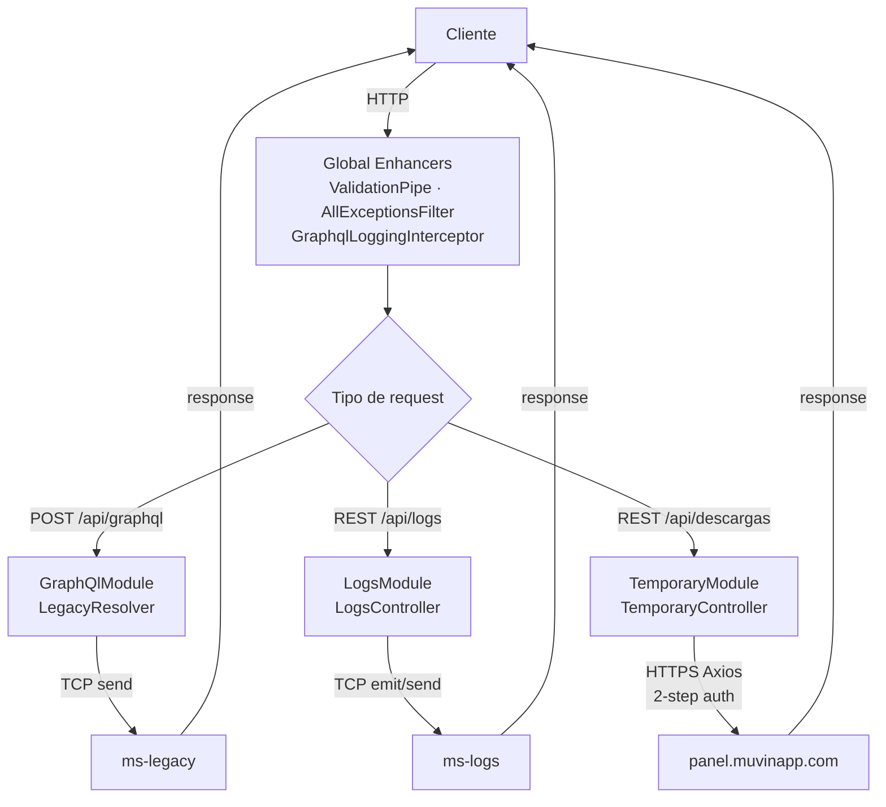

# Flujos Transversales — Índice

> **Última revisión:** 2026-04-29

Flujos que atraviesan múltiples capas o módulos de muvin-api.

---

## Flujos documentados

| Flujo | Descripción | Archivo |
|-------|-------------|---------|
| F-TX-01 | Ciclo de vida completo de un request REST | [[flujo-request-rest]] |
| F-TX-02 | Ciclo de vida completo de una query GraphQL | [[flujo-request-graphql]] |
| F-TX-03 | Comunicación con microservicios (TCP) | [[flujo-microservicios]] |

---

## Diagrama global de flujos

