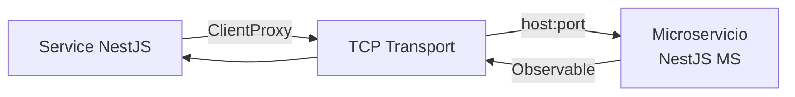

# Flujo: Comunicación con microservicios (TCP)

> **Aplica a:** módulos `legacy` y `logs`
> **Última revisión:** 2026-04-29

---

## Patrón de comunicación

muvin-api se comunica con los microservicios internos usando el **transporte TCP de NestJS** (`@nestjs/microservices`). Cada módulo inyecta un `ClientProxy` que abstrae el protocolo.



---

## send() vs emit()

```mermaid
flowchart TD
    subgraph send — Request-Response
        A1[service.send pattern data] --> B1[TCP request]
        B1 --> C1[Microservicio procesa]
        C1 --> D1[Observable con respuesta]
        D1 -->|firstValueFrom| E1[Promise resuelta]
    end

    subgraph emit — Fire and Forget
        A2[service.emit pattern data] --> B2[TCP message]
        B2 --> C2[Microservicio procesa\nsin retorno]
        A2 -.->|no espera| D2[void inmediato]
    end
```

| Método | Espera respuesta | Usado en |
|--------|-----------------|----------|
| `send()` | ✅ Sí (Observable) | `LogsService.searchId/User/Terms`, `LegacyResolver.legacy` |
| `emit()` | ❌ No (fire-and-forget) | `LogsService.create`, `LogsService.update` |

---

## Registro de microservicios

### LegacyModule — via factory

```typescript
MICROSERVICE_INTERCEPTOR(
  LEGACY_MICROSERVICE_TRANSPORT,
  LEGACY_MICROSERVICE_HOST,
  LEGACY_MICROSERVICE_PORT,
  LEGACY_MICROSERVICE_SERVICE,
)
```

### LogsModule — via ClientsModule

```typescript
ClientsModule.register([{
  name: LOGS_MICROSERVICE_SERVICE,
  transport: LOGS_MICROSERVICE_TRANSPORT,
  options: {
    host: LOGS_MICROSERVICE_HOST,
    port: LOGS_MICROSERVICE_PORT,
  },
}])
```

---

## Nombres de mensajes (CMDS)

Los patrones de los mensajes TCP están centralizados en `common/cmd/constant.ts`:

```typescript
CMDS.logs.legacy.create    // emit → crear log
CMDS.logs.legacy.update    // emit → actualizar log
CMDS.logs.legacy.search.id     // send → buscar por id
CMDS.logs.legacy.search.user   // send → buscar por usuario
CMDS.logs.legacy.search.terms  // send → buscar por términos
```

Para ms-legacy, el patrón es `''` (string vacío) y el endpoint se pasa como parte del payload.

---

## Variables de entorno requeridas

| Variable | Microservicio | Descripción |
|----------|--------------|-------------|
| `LEGACY_MICROSERVICE_HOST` | ms-legacy | Host TCP |
| `LEGACY_MICROSERVICE_PORT` | ms-legacy | Puerto TCP |
| `LEGACY_MICROSERVICE_TRANSPORT` | ms-legacy | `Transport.TCP` |
| `LEGACY_MICROSERVICE_SERVICE` | ms-legacy | Token de inyección |
| `LOGS_MICROSERVICE_HOST` | ms-logs | Host TCP |
| `LOGS_MICROSERVICE_PORT` | ms-logs | Puerto TCP |
| `LOGS_MICROSERVICE_TRANSPORT` | ms-logs | `Transport.TCP` |
| `LOGS_MICROSERVICE_SERVICE` | ms-logs | Token de inyección |

---

## Referencias

- [[modulo-legacy]]
- [[modulo-logs]]
- [[stack-tecnologico]]
