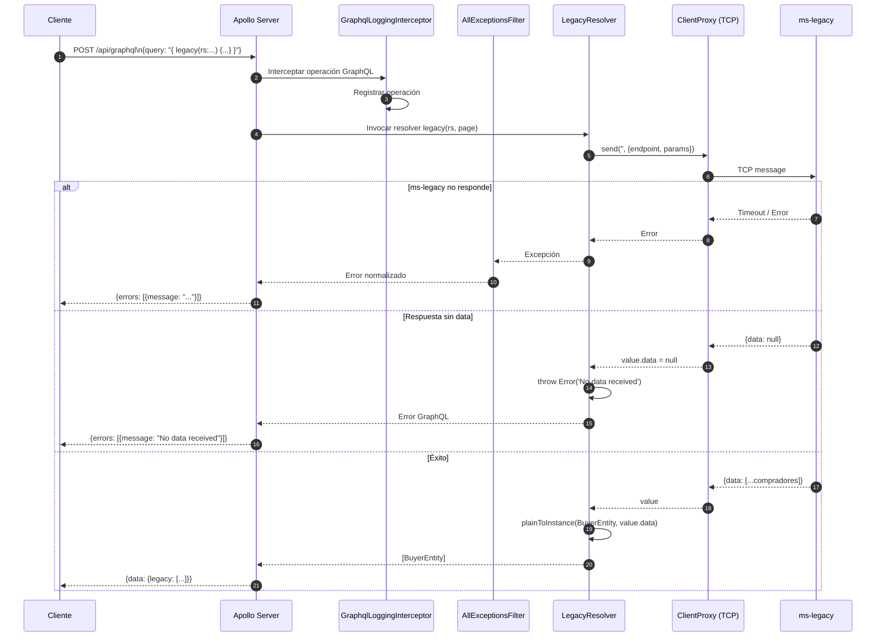

# Flujo: Query GraphQL completa

> **Aplica a:** módulo `legacy`
> **Última revisión:** 2026-04-29

---

## Ciclo de vida de una query GraphQL



---

## Schema generado (code-first)

NestJS genera `src/schema.gql` automáticamente al arrancar/compilar:

```graphql
type BuyerEntity {
  id: Int!
  rs: String!
  cuit: String!
}

type Query {
  legacy(rs: String!, page: Int): [BuyerEntity!]!
}
```

> El archivo `schema.gql` **no debe editarse manualmente** — se sobreescribe en cada build.

---

## GraphqlLoggingInterceptor

Interceptor global registrado en `main.ts` que actúa sobre **todas las operaciones GraphQL**:

```typescript
app.useGlobalInterceptors(new GraphqlLoggingInterceptor());
```

Registra cada operación (query/mutation) para trazabilidad.

---

## Referencias

- [[arquitectura-general]]
- [[modulo-legacy]]
- [[f01-legacy-query]]
