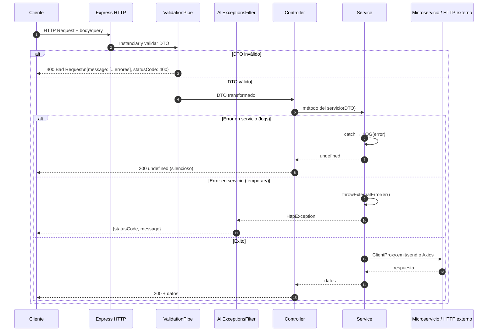

# Flujo: Request REST completo

> **Aplica a:** módulos `logs` y `temporary`
> **Última revisión:** 2026-04-29

---

## Ciclo de vida de un request REST



---

## Comportamiento por módulo

| Módulo | Error en servicio | Respuesta al cliente |
|--------|------------------|----------------------|
| `logs` | Silenciado con `catch` + `LOG()` | `200 undefined` |
| `temporary` | `HttpException` propagada | Status del servicio externo o `502` |

---

## Configuración de ValidationPipe

```typescript
new ValidationPipe({
  transform: true,           // Transforma tipos (string → number, etc.)
  whitelist: true,           // Elimina propiedades no declaradas en el DTO
  forbidNonWhitelisted: true // Lanza error si hay propiedades extra
})
```

---

## Referencias

- [[arquitectura-general]]
- [[modulo-logs]]
- [[modulo-temporary]]
