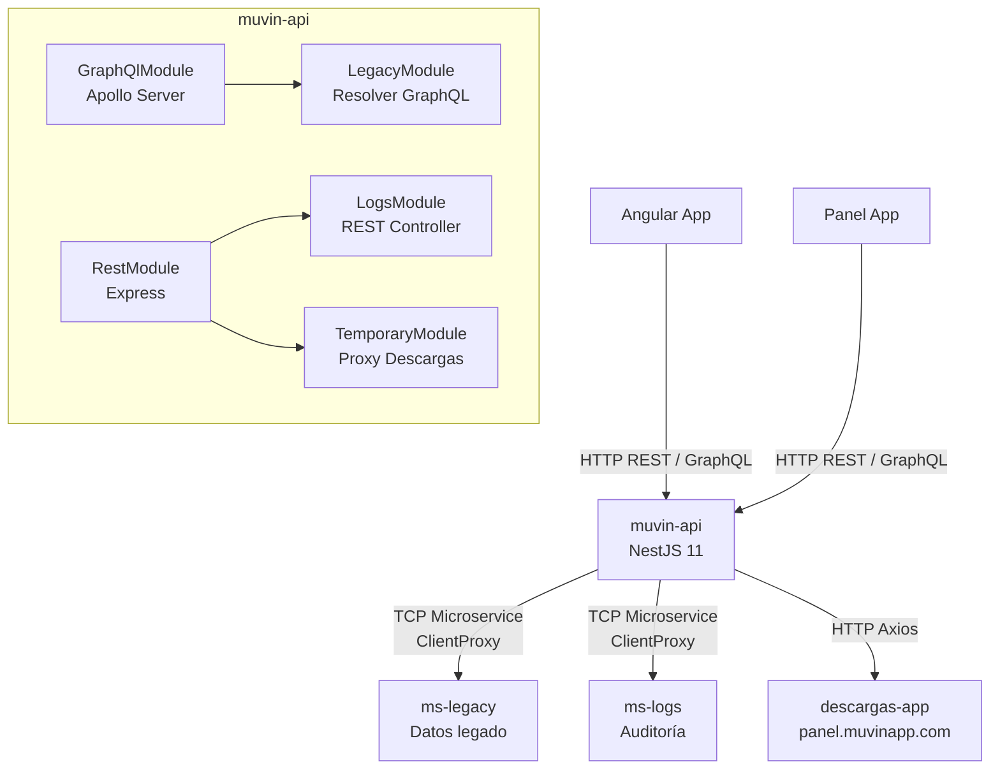

# muvin-api — Documentación

> **Stack:** NestJS 11 · TypeScript · GraphQL (Apollo) · REST · Microservicios TCP
> **Última revisión:** 2026-04-29

---

## ¿Qué es muvin-api?

`muvin-api` es la **API Gateway / BFF (Backend For Frontend)** principal de la plataforma Muvin. Actúa como punto de entrada único para clientes web (app, panel) y orquesta las comunicaciones hacia los microservicios internos del ecosistema.

Expone **dos protocolos** en paralelo:

| Protocolo | Módulo raíz | Uso principal |
|-----------|-------------|---------------|
| **GraphQL** | `GraphQlModule` | Integración con ms-legacy (compradores, datos históricos) |
| **REST** | `RestModule` | Logs de auditoría + proxy de descargas |

---

## Arquitectura de alto nivel

---

## Módulos

| Módulo | Protocolo | Descripción |
|--------|-----------|-------------|
| [[modulo-legacy]] | GraphQL | Query de compradores hacia ms-legacy |
| [[modulo-logs]] | REST | CRUD de logs de auditoría hacia ms-logs |
| [[modulo-temporary]] | REST | Proxy HTTP hacia descargas-app |

---

## Endpoints rápidos

| Tipo | Ruta | Descripción |
|------|------|-------------|
| GraphQL | `POST /api/graphql` | Playground Apollo + queries legacy |
| REST | `POST /api/logs` | Crear log |
| REST | `PUT /api/logs` | Actualizar log |
| REST | `GET /api/logs/by-id` | Buscar log por ID |
| REST | `GET /api/logs/by-user` | Buscar logs por usuario |
| REST | `GET /api/logs/by-terms` | Buscar logs por términos |
| REST | `POST /api/descargas` | Proxy hacia descargas-app |

---

## Secciones de documentación

- [[vision-general]]
- [[stack-tecnologico]]
- [[arquitectura-general]]
- [[glosario]]
- [[_indice-modulos]]
- [[_indice-funcionalidades]]
- [[_indice-servicios]]
- [[_indice-entidades]]
- [[tree-estructura-archivos]]
- [[deuda-tecnica]]
