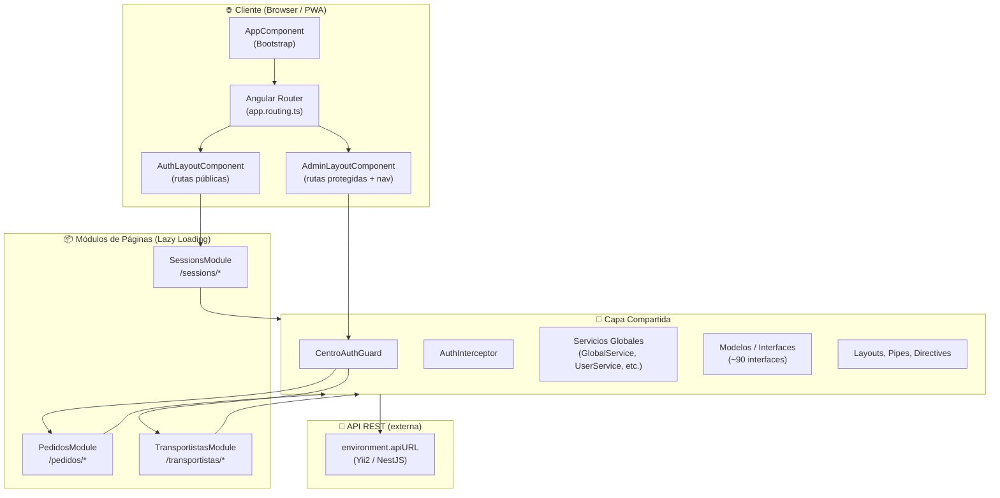

# Arquitectura de Alto Nivel — App Agronomy

> **Última revisión:** 2026-04-30

## Capas del sistema

## Descripción de capas

### Presentación
- **AppComponent**: raíz de la aplicación, configura tema y traducciones.
- **AuthLayoutComponent**: layout sin barra de navegación para rutas públicas (`/sessions/*`).
- **AdminLayoutComponent**: layout completo con sidebar y navbar para rutas protegidas.

### Lógica de aplicación
- Módulos lazy-loaded: `SessionsModule`, `PedidosModule`, `TransportistasModule`.
- Cada módulo encapsula sus propios componentes, servicios y modelos.
- La capa `Shared` provee servicios transversales, guards, interceptors y componentes reutilizables.

### Autenticación y seguridad
- **CentroAuthGuard**: valida token en `localStorage` y filtra por rol (`3`, `11`, `16`). Si no hay token, redirige a `/sessions/signin`.
- **AuthInterceptor**: ⚠️ Pendiente de verificar si existe un interceptor HTTP que inyecte el token en los headers.
- Token almacenado en `localStorage` (clave `token`). Sin expiración activa validada en el guard actualmente. 🔴

### Datos
- La app es **stateless en el frontend**: no usa NGXS, Redux ni ningún store reactivo.
- El estado se gestiona con servicios + `BehaviorSubject` / `EventEmitter` puntualmente.
- Toda persistencia está en la **API REST** externa.

### Integración
- `environment.apiURL` define el host del backend (configurado por ambiente: dev/prod).
- Google Maps API integrada via `@angular/google-maps`.
- Service Worker para capacidades PWA offline.
