# Módulo: Pedidos

> **Ruta/Namespace:** `src/app/pages/pedidos/`
> **Criticidad:** 🔴 Alta
> **Estado:** Activo

## Propósito

Módulo central de la aplicación. Gestiona el ciclo completo de solicitudes de despacho de mercadería (granos y fertilizantes): creación de pedidos, visualización de reservas y cupos, asignación de choferes y vehículos, seguimiento del estado de despacho, y operaciones sobre mezclas de fertilizantes. Es el módulo con mayor cantidad de componentes y servicios.

## Funcionalidades que expone

| # | Funcionalidad | Descripción breve | Detalle |
|---|--------------|-------------------|---------|
| 2.1 | Listado de pedidos | Tabla paginada y filtrable de pedidos del centro | [[pedidos-listado]] |
| 2.2 | Agregar pedido | Wizard para crear un nuevo pedido/reserva | [[pedidos-add-pedido]] |
| 2.3 | Agregar destino | Selector de destino en el flujo de alta | [[pedidos-add-destination]] |
| 2.4 | Asignar chofer | Selección de chofer para despacho | [[pedidos-asignar-chofer]] |
| 2.5 | Asignar directo | Despacho directo sin turno | [[pedidos-asignar-directo]] |
| 2.6 | Ver cupos de reserva | Detalle de cupos disponibles por reserva | [[pedidos-ver-cupos-reserva]] |
| 2.7 | Detalle de cupos | Vista detallada de cupos | [[pedidos-detalle-cupos]] |
| 2.8 | Detalle reserva - asignar | Detalle de reserva en flujo de asignación | [[pedidos-detalles-reserva-asignar]] |
| 2.9 | Detalle reserva - cupos | Detalle de cupos de una reserva | [[pedidos-detalles-reserva-cupos]] |
| 2.10 | Detalle reserva - productos | Detalle de productos de una reserva | [[pedidos-detalles-reserva-productos]] |
| 2.11 | Camión | Vista/formulario de datos del camión | [[pedidos-camion]] |
| 2.12 | Pick chofer | Selector de chofer desde lista | [[pedidos-pick-chofer]] |
| 2.13 | Pick patente | Selector de camión por patente | [[pedidos-pick-patente]] |
| 2.14 | Tipo de despacho | Selección de modalidad de despacho | [[pedidos-tipo-despacho]] |
| 2.15 | Observaciones | Agregar observaciones al pedido | [[pedidos-observaciones]] |
| 2.16 | Productos mezcla | Gestión de productos en mezcla fertilizante | [[pedidos-productos-mezcla]] |
| 2.17 | Ítem mezcla | Detalle de ítem individual en mezcla | [[pedidos-item-mezcla]] |

## Dependencias

- **Depende de:** [[modulo-shared]], [[modulo-transportistas]] (modelos de camión/chofer)
- **Es usado por:** Ruta raíz `/pedidos` (destino por defecto del router)
- **Consume servicios backend:** `PedidosService`, `ReservasService`, `HomeService`, `OrigenesService`, `FertilizantesService`

## Diagrama de componentes internos

```mermaid
graph TD
    Router["PedidosRoutingModule\n/pedidos/*"]
    PedidosComp["PedidosComponent\n(listado principal)"]
    AddPedido["AddPedidoComponent\n(wizard alta)"]
    AddDest["AddDestinationComponent"]
    AsignarChofer["AsignarChoferComponent"]
    AsignarDirecto["AsignarDirectoComponent"]
    VerCupos["VerCuposReservaComponent"]
    DetalleCupos["DetalleCuposComponent"]
    DetalleAsignar["DetalleReservaAsignarComponent"]
    DetalleCuposRes["DetalleReservaCuposComponent"]
    DetalleProds["DetalleReservaProductosComponent"]
    Camion["CamionComponent"]
    PickChofer["PickChoferComponent"]
    PickPatente["PickPatenteComponent"]
    TipoDespacho["TipoDespachoComponent"]
    Obs["PedidoObservacionesComponent"]
    ProdMezcla["ProductosMezclaComponent"]
    ItemMezcla["ItemMezclaComponent"]

    PedidosSvc["PedidosService"]
    ReservasSvc["ReservasService"]
    HomeSvc["HomeService"]
    OrigenSvc["OrigenesService"]
    FertSvc["FertilizantesService"]

    Router --> PedidosComp
    Router --> AddPedido
    AddPedido --> AddDest
    AddPedido --> TipoDespacho
    AddPedido --> ProdMezcla --> ItemMezcla
    PedidosComp --> AsignarChofer --> PickChofer
    PedidosComp --> AsignarDirecto
    PedidosComp --> VerCupos --> DetalleCupos
    PedidosComp --> DetalleAsignar
    PedidosComp --> DetalleCuposRes
    PedidosComp --> DetalleProds
    AsignarChofer --> Camion --> PickPatente
    PedidosComp --> Obs

    PedidosComp --> PedidosSvc
    AddPedido --> ReservasSvc
    AddPedido --> OrigenSvc
    ProdMezcla --> FertSvc
    PedidosComp --> HomeSvc
```

## Servicios Backend Consumidos

| Verbo | Ruta | Propósito | Detalle |
|-------|------|-----------|---------|
| GET | `pedido/pedido-centro2` | Listado paginado de pedidos (rol centro) | [[pedidos-endpoints#GET-pedido-centro2]] |
| GET | `pedido/by-dador` | Listado de pedidos por dador (rol 5) | [[pedidos-endpoints#GET-by-dador]] |
| GET | `seguimiento/filtrar-reservas` | Listado de reservas con filtros | [[seguimiento-endpoints#GET-filtrar-reservas]] |
| GET | `seguimiento/filtrar-capacidad-terminal` | Capacidad disponible en terminal | [[seguimiento-endpoints#GET-capacidad-terminal]] |
| GET | `seguimiento/detalle-reservas` | Detalle de reservas de un cliente/origen | [[seguimiento-endpoints#GET-detalle-reservas]] |
| GET | `seguimiento/detalle-reservas-fertilizante` | Detalle reservas fertilizantes | [[seguimiento-endpoints#GET-detalle-reservas-fertilizante]] |
| GET | `seguimiento/select-zona-cliente` | Select de zonas de cliente | [[seguimiento-endpoints]] |
| GET | `seguimiento/select-grupo-cliente` | Select de grupos de cliente | [[seguimiento-endpoints]] |
| GET | `seguimiento/select-clientes` | Select de clientes | [[seguimiento-endpoints]] |
| GET | `seguimiento/cuit-verify` | Verificar CUIT / razón social | [[seguimiento-endpoints]] |
| GET | `origen/validate-origens-by-cuit` | Validar origen por CUIT y destino | [[origen-endpoints]] |
| GET | `origen/select-merge-provider` | Destinos de proveedores | [[origen-endpoints]] |
| GET | `pedido/verify-cliente-proveedor` | Verificar cliente-proveedor | [[pedidos-endpoints]] |
| GET | `fertilizantes/reserva/by-pedido` | Detalle reservas fertilizantes (nuevo) | [[fertilizantes-endpoints]] |

## Entidades de datos implicadas

[[pedido-model]], [[reserva-model]], [[cupo-model]], [[origen-model]], [[destino-model]], [[producto-model]], [[camion-model]], [[chofer-model]]

## Riesgos y deuda técnica detectados

- ⚠️ Múltiples métodos comentados en `PedidosService` (endpoints Yii2 legacy). Indica refactor en curso no completado.
- ⚠️ `EventEmitter` usado como canal de comunicación entre servicios (`filtros$`, `dataReservas$`) en lugar de `Subject`. Antipatrón en Angular.
- 🔴 `detalleReservasSeguimiento()` construye la URL manualmente con interpolación de strings sin sanitización.
- ⚠️ Lógica de rol (rol `3` vs otros) hardcodeada en `reservas.service.ts` con acceso directo a `localStorage`.
- 🚧 `add-destination`, `tipo-despacho` no tienen documentación propia aún.

## Archivos fuente relevantes

- `src/app/pages/pedidos/pedidos.module.ts`
- `src/app/pages/pedidos/pedidos-routing.module.ts`
- `src/app/pages/pedidos/services/pedidos.service.ts`
- `src/app/pages/pedidos/services/reservas.service.ts`
- `src/app/pages/pedidos/services/home.service.ts`
- `src/app/pages/pedidos/services/origenes.service.ts`
- `src/app/pages/pedidos/services/fertilizantes.service.ts`
- `src/app/pages/pedidos/models/`
- `src/app/pages/pedidos/components/`
