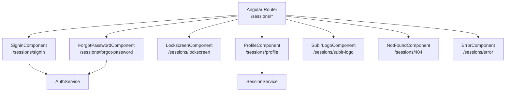

# Módulo: Sessions

> **Ruta/Namespace:** `src/app/pages/sessions/`
> **Criticidad:** 🔴 Alta
> **Estado:** Activo

## Propósito

Gestiona el ciclo de autenticación del usuario: login con usuario/contraseña y reCAPTCHA, recupero de contraseña, bloqueo de pantalla, perfil de usuario y pantallas de error (404, genérica). Es la puerta de entrada obligatoria al sistema y opera bajo el `AuthLayoutComponent` (sin barra de navegación lateral).

## Funcionalidades que expone

| # | Funcionalidad | Descripción breve | Detalle |
|---|--------------|-------------------|---------|
| 1.1 | Sign In | Login con email, contraseña y reCAPTCHA | [[sessions-signin]] |
| 1.2 | Forgot Password | Recupero de contraseña por email | [[sessions-forgot-password]] |
| 1.3 | Lockscreen | Pantalla de bloqueo de sesión | [[sessions-lockscreen]] |
| 1.4 | Perfil de usuario | Edición de datos del perfil | [[sessions-profile]] |
| 1.5 | Subir logo | Upload del logo de la empresa | [[sessions-subir-logo]] |
| 1.6 | Not Found (404) | Pantalla 404 | — |
| 1.7 | Error | Pantalla de error genérica | — |

## Dependencias

- **Depende de:** [[modulo-shared]]
- **Es usado por:** Punto de entrada del sistema (no es consumido por otros módulos)
- **Consume servicios backend:** `AuthService`, `SessionService`

## Diagrama de componentes

## Servicios Backend Consumidos

| Verbo | Ruta | Propósito | Detalle |
|-------|------|-----------|---------|
| POST | `login/login-panel` | Login con credenciales + reCAPTCHA | [[auth-endpoints#POST-login-panel]] |
| POST | `login/access-token` | Obtener access token post-login | [[auth-endpoints#POST-access-token]] |

## Entidades de datos implicadas

[[user-model]], [[persona-model]]

## Riesgos y deuda técnica detectados

- 🔴 El token se almacena en `localStorage` sin cifrado. Vulnerable a XSS.
- 🔴 La condición de expiración de token en `CentroAuthGuard` está **comentada** (`/* if (dateExpires < now) */`). El token nunca expira en el frontend.
- ⚠️ `AuthService.login()` usa `if (res.status = 1)` (asignación, no comparación). Bug silencioso.
- ⚠️ `ng-recaptcha` está en versión `12.0.2`, desactualizada respecto a Angular 16.
- 💀 Método `prueba()` en `AuthService` parece ser código de prueba/debug. No debe estar en producción.

## Archivos fuente relevantes

- `src/app/pages/sessions/sessions.module.ts`
- `src/app/pages/sessions/sessions-routing.module.ts`
- `src/app/pages/sessions/services/auth.service.ts`
- `src/app/pages/sessions/services/session.service.ts`
- `src/app/pages/sessions/components/signin/`
- `src/app/pages/sessions/components/forgot-password/`
- `src/app/pages/sessions/components/profile/`
- `src/app/shared/guards/centro-auth.guard.ts`
