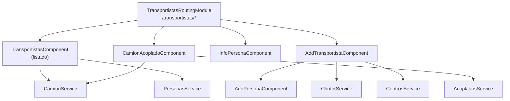

# Módulo: Transportistas

> **Ruta/Namespace:** `src/app/pages/transportistas/`
> **Criticidad:** 🟡 Media
> **Estado:** Activo

## Propósito

Gestiona el ABM (alta, baja, modificación) de los transportistas vinculados al centro: personas físicas/jurídicas, choferes, camiones y acoplados. Permite registrar nuevos transportistas y sus equipos de transporte para luego poder asignarlos en el módulo de Pedidos.

## Funcionalidades que expone

| # | Funcionalidad | Descripción breve | Detalle |
|---|--------------|-------------------|---------|
| 3.1 | Listado de transportistas | Tabla de transportistas del centro | [[transportistas-listado]] |
| 3.2 | Agregar transportista | Formulario de alta de transportista | [[transportistas-add]] |
| 3.3 | Agregar persona | Alta de persona (física/jurídica) | [[transportistas-add-persona]] |
| 3.4 | Info persona | Detalle/consulta de datos de persona | [[transportistas-info-persona]] |
| 3.5 | Camión-Acoplado | Alta y gestión de equipos de transporte | [[transportistas-camion-acoplado]] |

## Dependencias

- **Depende de:** [[modulo-shared]]
- **Es usado por:** [[modulo-pedidos]] (selección de choferes y camiones en asignación)
- **Consume servicios backend:** `CamionService`, `ChoferService`, `PersonasService`, `CentrosService`, `AcopladosService`, `UserService` (transportistas)

## Diagrama de componentes internos

## Servicios Backend Consumidos

| Verbo | Ruta | Propósito | Detalle |
|-------|------|-----------|---------|
| GET | `camion` | Listado paginado de camiones por patente | [[transportistas-endpoints#GET-camion]] |
| GET | `camion/patente-existe` | Verificar si una patente ya existe | [[transportistas-endpoints#GET-patente-existe]] |
| POST | `chofer/carga-masiva` | Alta masiva de choferes | [[transportistas-endpoints#POST-chofer-carga-masiva]] |

## Entidades de datos implicadas

[[camion-model]], [[chofer-model]], [[acoplado-model]], [[persona-model]], [[transportista-model]]

## Riesgos y deuda técnica detectados

- 💀 `CamionService` tiene múltiples métodos comentados (`postCamion`, `getCamionByPatente`, `getCamionSinEquipo`, `postBloquearCamion`, etc.). Funcionalidad no migrada o abandonada.
- ⚠️ `ChoferService.addChofer()` contiene un `console.log(chofer)` en producción. 🔒 Expone datos sensibles en consola del browser.
- ⚠️ Servicios `AcopladosService`, `PersonasService`, `CentrosService` no analizados en detalle. 🚧 Pendiente de revisión.

## Archivos fuente relevantes

- `src/app/pages/transportistas/transportistas.module.ts`
- `src/app/pages/transportistas/transportistas-routing.module.ts`
- `src/app/pages/transportistas/services/camion.service.ts`
- `src/app/pages/transportistas/services/chofer.service.ts`
- `src/app/pages/transportistas/services/personas.service.ts`
- `src/app/pages/transportistas/services/centros.service.ts`
- `src/app/pages/transportistas/services/acoplados.service.ts`
- `src/app/pages/transportistas/services/user.service.ts`
- `src/app/pages/transportistas/models/`
- `src/app/pages/transportistas/components/`
