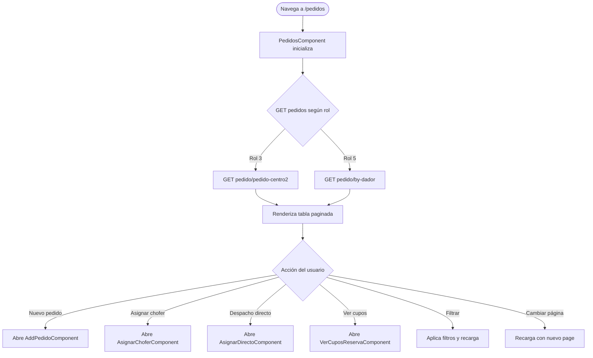

# Funcionalidad: Listado de Pedidos

> **Módulo:** [[modulo-pedidos]]
> **Ruta UI:** `/pedidos`
> **Tipo:** Listado + CRUD + Asignación

## Descripción funcional

Pantalla principal del módulo Pedidos. Muestra una tabla paginada (10 registros por página) de los pedidos/reservas del centro autenticado. Permite filtrar por producto, fecha desde/hasta. Desde esta pantalla se accede a todas las acciones sobre pedidos: ver detalles, asignar chofer/camión, despacho directo, ver cupos, agregar observaciones y crear nuevos pedidos.

El comportamiento de la tabla varía según el rol del usuario:
- Rol `3` (centro): ve pedidos del centro (`pedido/pedido-centro2`)
- Rol `5` (dador): ve sus propios pedidos (`pedido/by-dador`)

## Precondiciones

- Usuario autenticado con rol `3`, `11` o `16` (guard `CentroAuthGuard`).
- Token válido en `localStorage`.

## Flujo principal

## Servicios backend invocados

| Paso | Verbo | Ruta | Payload resumido | Respuesta resumida |
|------|-------|------|-----------------|-------------------|
| Carga | GET | `pedido/pedido-centro2` | `?page=N&per-page=10&Search[...]` | `{data: [...], _meta: {pageCount, ...}}` |
| Dador | GET | `pedido/by-dador` | `?page=N&per-page=10` | `{data: [...]}` |

## Filtros disponibles

| Filtro | Parámetro backend | Tipo |
|--------|--------------------|------|
| Producto | `Search[producto_nombre]` | string |
| Fecha desde | `Search[fecha_desde]` | date |
| Fecha hasta | `Search[fecha_hasta]` | date |
| En tiempo | `Search[en_tiempo]=1` | fijo |

## Datos que lee/escribe

- **Lee:** Pedidos del backend según rol
- **Escribe:** Delega a sub-funcionalidades (asignar chofer, etc.)

## Componentes UI involucrados

- `PedidosComponent` (`src/app/pages/pedidos/components/pedidos/`)

## Riesgos específicos

- ⚠️ Rol leído directamente de `localStorage` en el servicio, sin un store centralizado. Si el rol cambia en sesión, no se refleja sin recargar.
- ⚠️ `Search[en_tiempo]=1` siempre está activo (fijo). Filtra pedidos "en tiempo". No hay forma de ver pedidos fuera del rango desde la UI. 🚧 Verificar si es intencional.
