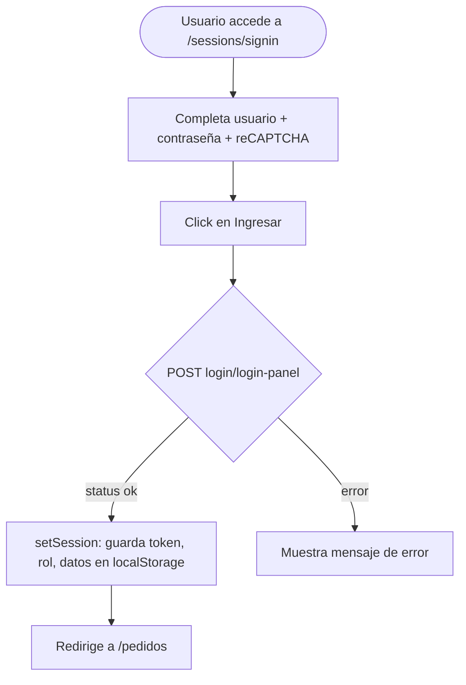

# Funcionalidad: Sign In (Login)

> **Módulo:** [[modulo-sessions]]
> **Ruta UI:** `/sessions/signin`
> **Tipo:** Autenticación

## Descripción funcional

Pantalla de inicio de sesión. El usuario ingresa su nombre de usuario (CUIT o email) y contraseña. Incluye validación de reCAPTCHA v2 para prevenir ataques automatizados. El sistema detecta si el acceso es desde un dispositivo móvil (`userAgent`) y envía el canal (`pwa` o `desktop`) al backend. Tras la autenticación exitosa, redirige a `/pedidos`.

## Precondiciones

- El usuario debe tener cuenta activa en el sistema.
- La integración con reCAPTCHA debe estar configurada con una siteKey válida.

## Flujo principal

## Flujos alternativos

- Si el token ya existe en `localStorage`, el guard redirige directamente a `/pedidos` sin mostrar el login.
- Si el reCAPTCHA falla, el backend rechaza la petición.

## Validaciones de negocio

| Validación | Mensaje al usuario | Ubicación en código |
|------------|-------------------|---------------------|
| Campos requeridos | ⚠️ Pendiente de verificar | `signin.component.ts` |
| reCAPTCHA válido | ⚠️ Pendiente de verificar | `auth.service.ts` |

## Servicios backend invocados

| Paso | Verbo | Ruta | Payload resumido | Respuesta resumida |
|------|-------|------|-----------------|-------------------|
| 1 | POST | `login/login-panel` | `{username, password, captcha, Canal}` | `{status, data: {token, rol, ...}}` |

## Datos que lee/escribe

- **Escribe en `localStorage`:** `token`, `rol`, `currentUser`, `tipo_turneada`, `linea_whats_app`, `contratoRequerido`, `expires_at`

## Componentes UI involucrados

- `SigninComponent` (`src/app/pages/sessions/components/signin/`)

## Riesgos específicos

- 🔴 `if (res.status = 1)` es una **asignación**, no comparación. El bloque siempre se ejecuta independientemente del status real del servidor.
- 🔒 Token almacenado en `localStorage`: vulnerable a robo por XSS.
- ⚠️ No hay manejo de errores HTTP visible en el componente de login.
