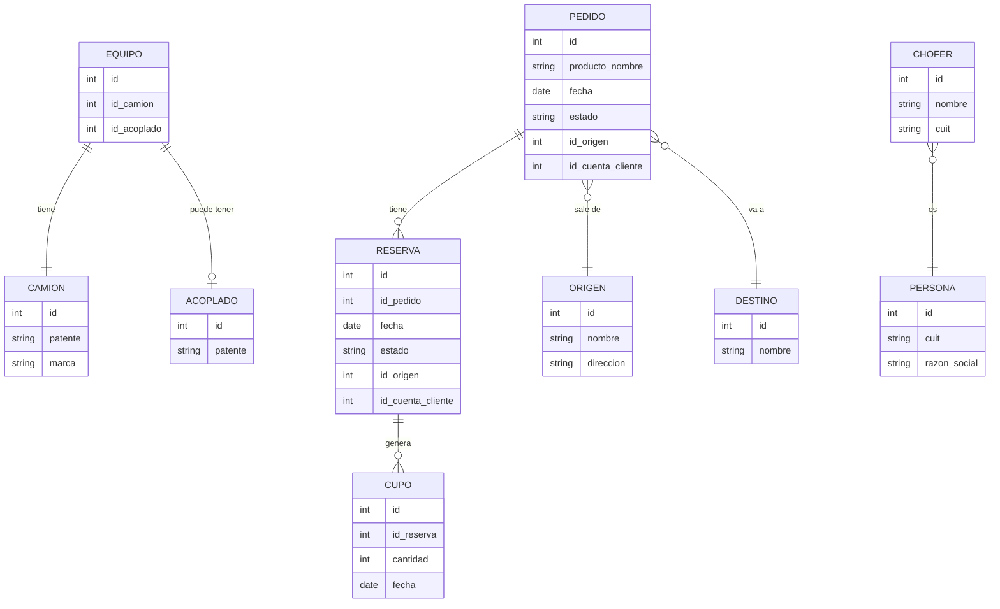

# Índice de Entidades — App Agronomy

> **Última revisión:** 2026-04-30

La app-agronomy es un frontend puro. Las entidades aquí listadas corresponden a las **interfaces TypeScript** que modelan los datos intercambiados con la API REST.

## Entidades principales

| Entidad | Archivo | Descripción |
|---------|---------|-------------|
| Pedido | `shared/models/pedido.ts`, `pedidoModel.ts` | Solicitud de despacho |
| Reserva | `shared/models/reserva*`, `lista-reserva-models.ts` | Cupo asignado |
| Cupo | `shared/models/cupo.ts`, `cuposDisponibles.ts` | Capacidad disponible |
| Origen | `shared/models/origen.model.ts`, `origen.ts` | Terminal/punto de carga |
| Destino | `shared/models/destino.ts` | Punto de entrega |
| Producto | `shared/models/producto.ts`, `product.model.ts` | Producto agroindustrial |
| Fertilizante | `shared/models/fertilizantes.model.ts` | Detalle de reserva fertilizante |
| Camión | `shared/models/camion.ts`, `pages/pedidos/models/camion.ts` | Vehículo de carga |
| Acoplado | `shared/models/acoplado.ts` | Remolque |
| Chofer | `shared/models/chofer.ts`, `pages/pedidos/models/chofer.ts` | Conductor |
| Equipo | `shared/models/equipo.ts` | Combinación camión+acoplado |
| Usuario | `shared/models/user.ts`, `user.model.ts` | Usuario del sistema |
| Persona | `shared/models/persona.model.ts` | Persona física/jurídica |
| Proveedor | `pages/pedidos/models/proveedor.ts` | Proveedor de carga |
| Viaje | `shared/models/viaje.ts`, `viaje-lista.ts` | Viaje logístico |
| Seguimiento | `shared/models/seguimiento.ts` | Estado de seguimiento |

> [!info] Nota
> Existen ~90 archivos de modelos en `src/app/shared/models/`. Muchos son variantes o extensiones de las entidades principales listadas arriba. Se recomienda una auditoría de duplicados.

## Diagrama ER simplificado

