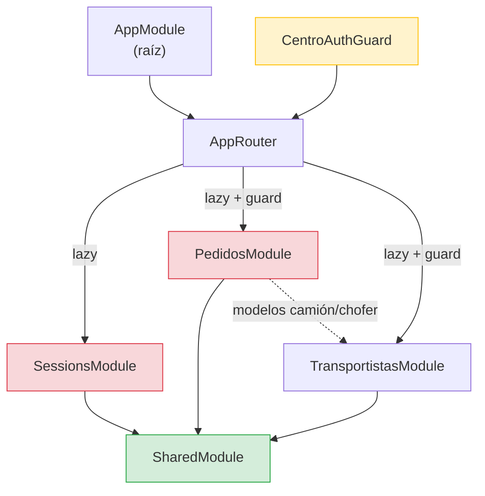

# Dependencias entre Módulos — App Agronomy

> **Última revisión:** 2026-04-30

## Grafo de dependencias

## Descripción de dependencias

| Módulo origen | Módulo destino | Tipo de dependencia |
|---------------|---------------|---------------------|
| `SessionsModule` | `SharedModule` | Importación directa (servicios, guards, modelos) |
| `PedidosModule` | `SharedModule` | Importación directa |
| `TransportistasModule` | `SharedModule` | Importación directa |
| `PedidosModule` | `TransportistasModule` | Reutilización de modelos (`camion.ts`, `chofer.ts`) — dependencia implícita |
| `AppModule` | Todos los módulos de página | Lazy loading via Router |
| `CentroAuthGuard` | `PedidosModule` | Protege la ruta de carga |
| `CentroAuthGuard` | `TransportistasModule` | Protege la ruta de carga |

## Dependencias problemáticas

- ⚠️ `PedidosModule` tiene sus propios modelos `camion.ts` y `chofer.ts` en `pages/pedidos/models/` que duplican (o son variantes de) los de `shared/models/`. Genera inconsistencia de tipos y dificulta el mantenimiento.
- ⚠️ No existe un store centralizado (NGXS/NgRx). La comunicación inter-módulo se realiza via `BehaviorSubject` y `EventEmitter` en servicios del shared, lo que puede generar fugas de memoria si no se hace `unsubscribe` correctamente.
