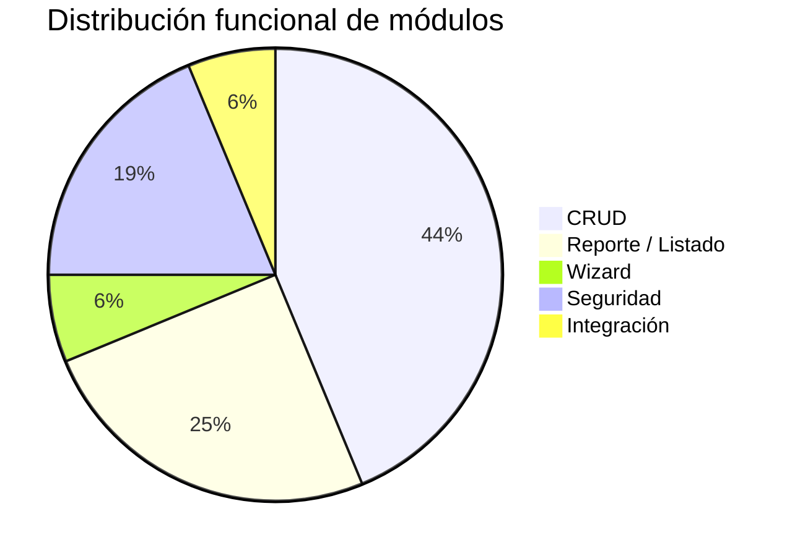

# Clasificación Funcional — App Agronomy

> **Última revisión:** 2026-04-30

## Tabla de clasificación

| Módulo / Funcionalidad | Tipo funcional | Descripción |
|------------------------|---------------|-------------|
| Sign In | Seguridad | Autenticación de usuarios |
| Forgot Password | Seguridad | Recupero de contraseña |
| Lockscreen | Seguridad | Bloqueo de pantalla |
| Perfil de usuario | CRUD | Edición de datos propios |
| Subir logo | CRUD | Upload de imagen corporativa |
| Listado de pedidos | Listado/Reporte | Vista tabular paginada con filtros |
| Agregar pedido | Wizard | Flujo multi-paso de alta de pedido |
| Asignar chofer | CRUD / Integración | Asignación de recurso a pedido |
| Asignar directo | CRUD | Despacho sin turno |
| Ver cupos reserva | Reporte | Consulta de disponibilidad |
| Detalle cupos | Reporte | Consulta detallada |
| Detalle reserva - asignar | CRUD | Operación sobre reserva existente |
| Productos mezcla | CRUD | Gestión de mezcla de fertilizantes |
| Listado transportistas | Listado/Reporte | Vista de transportistas del centro |
| Agregar transportista | CRUD | Alta de transportista + persona |
| Camión-Acoplado | CRUD | ABM de equipos de transporte |

## Distribución por tipo

