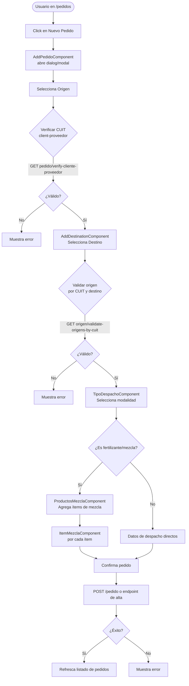

# Flujo: Alta de Pedido (end-to-end)

> **Módulos involucrados:** [[modulo-pedidos]], [[modulo-shared]]

## Descripción

Flujo completo para crear una nueva solicitud de despacho (pedido/reserva). Es el flujo más crítico de la aplicación. Involucra selección de origen, destino, producto, tipo de despacho, y opcionalmente la gestión de mezclas de fertilizantes.

## Diagrama

## Servicios invocados

| Paso | Verbo | Ruta | Servicio |
|------|-------|------|---------|
| Verificar CUIT | GET | `pedido/verify-cliente-proveedor` | `ReservasService` |
| Validar origen-destino | GET | `origen/validate-origens-by-cuit` | `ReservasService` |
| Destinos proveedores | GET | `origen/select-merge-provider` | `ReservasService` |
| Alta de pedido | POST | ⚠️ Pendiente de verificar endpoint exacto | `PedidosService` |

## Riesgos

- ⚠️ El endpoint de alta (`POST`) del pedido no está documentado en el código analizado. 🚧 Pendiente de verificar en `add-pedido` component.
- ⚠️ Flujo multi-paso sin persistencia intermedia: si el usuario cierra el dialog, pierde todos los datos ingresados.
