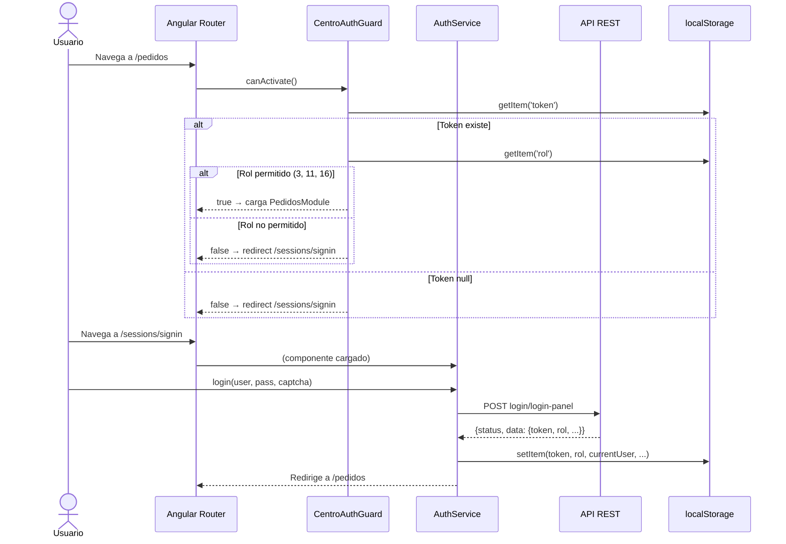
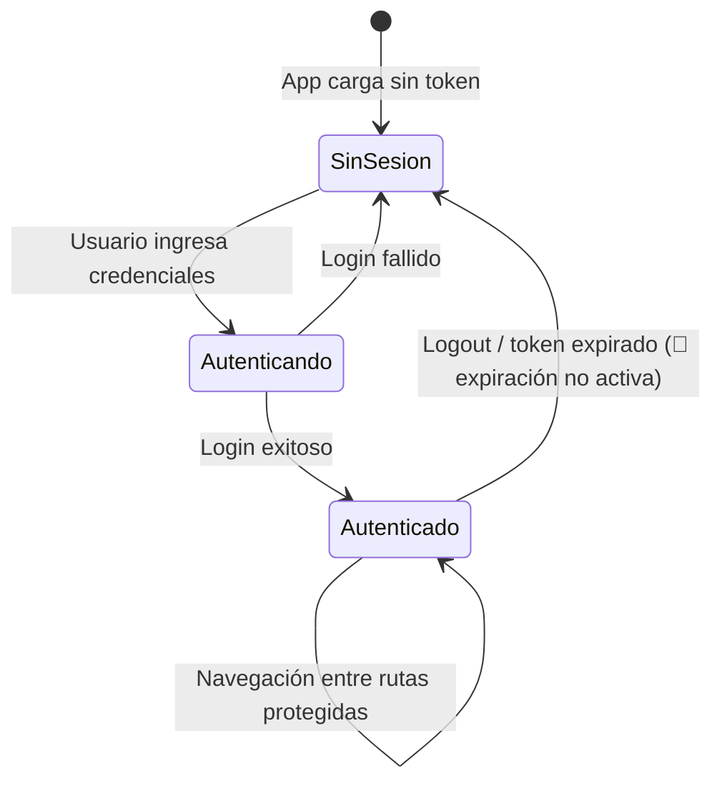

# Flujo: Autenticación y Autorización

> **Módulos involucrados:** [[modulo-sessions]], [[modulo-shared]] (CentroAuthGuard), [[modulo-pedidos]], [[modulo-transportistas]]

## Descripción

Flujo que cubre desde el acceso inicial a la app hasta el acceso a las pantallas protegidas. Incluye la verificación de token en cada navegación a rutas privadas.

## Diagrama

## Estados de sesión

## Riesgos del flujo

- 🔴 La expiración del token no se valida (guard comentado). Un token robado no expira en el frontend.
- 🔴 Bug de asignación (`=` en lugar de `===`) en el login. Ver [[security-inventory#SEC-03]].
- 🔴 Token en `localStorage`. Ver [[security-inventory#SEC-01]].
