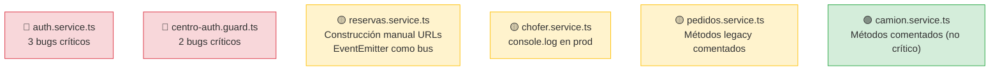

# Hotspots de Riesgo — App Agronomy

> **Última revisión:** 2026-04-30

Archivos y módulos con mayor concentración de problemas detectados.

## Mapa de hotspots

## Detalle por archivo

### `src/app/pages/sessions/services/auth.service.ts` 🔴
| Problema | Severidad | Línea aproximada |
|---------|-----------|-----------------|
| `if (res.status = 1)` (asignación, no comparación) | 🔴 | ~36, ~55 |
| Token en headers construido estáticamente | 🟡 | ~11-14 |
| Método `prueba()` de debug en producción | 🟡 | — |
| Método `test()` de debug en producción | 🟡 | — |

### `src/app/shared/guards/centro-auth.guard.ts` 🔴
| Problema | Severidad | Línea aproximada |
|---------|-----------|-----------------|
| Validación de expiración comentada | 🔴 | ~14-18 |
| Roles hardcodeados (`3`, `11`, `16`) | 🟢 | ~28-35 |

### `src/app/pages/pedidos/services/reservas.service.ts` 🟡
| Problema | Severidad |
|---------|-----------|
| `EventEmitter` usado como bus de eventos inter-servicio | 🟡 |
| Construcción de URLs por concatenación de strings | 🟡 |
| Rol leído directamente de `localStorage` | 🟡 |

### `src/app/pages/transportistas/services/chofer.service.ts` 🟡
| Problema | Severidad |
|---------|-----------|
| `console.log(chofer)` antes del POST (datos sensibles) | 🔴 |
