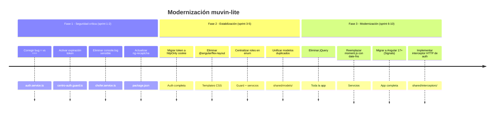

# Recomendaciones de Modernización — App Agronomy

> **Última revisión:** 2026-04-30

## Roadmap sugerido



## Detalle de recomendaciones clave

### 1. Migrar autenticación a `httpOnly` cookies
Actualmente el token en `localStorage` es el mayor riesgo de seguridad. Implementar:
- Backend: emitir cookie `httpOnly; Secure; SameSite=Strict`.
- Frontend: eliminar manejo manual de token en `localStorage`.
- Beneficio: elimina SEC-01, SEC-06, y reduce superficie XSS.

### 2. Agregar interceptor HTTP de autenticación
Crear un `AuthInterceptor` en `shared/interceptors/` que inyecte el token en cada petición:
```typescript
// Patrón recomendado
intercept(req: HttpRequest<any>, next: HttpHandler) {
  const token = localStorage.getItem('token'); // → futuramente desde cookie
  const authReq = req.clone({ setHeaders: { Authorization: `Bearer ${token}` } });
  return next.handle(authReq);
}
```

### 3. Reemplazar `@angular/flex-layout` por CSS nativo
`flex-layout` fue deprecado en 2023. La mayoría de sus directivas (`fxLayout`, `fxFlex`) se pueden reemplazar con clases CSS de Bootstrap 5 (ya incluido) o Flexbox/Grid nativo.

### 4. Centralizar roles en un enum
```typescript
// src/app/shared/enums/rol.enum.ts
export enum Rol {
  CENTRO = '3',
  DADOR = '5',
  AUXILIAR_1 = '11',
  AUXILIAR_2 = '16'
}
```

### 5. Migrar a Angular Signals (v17+)
Angular 17 introduce Signals como mecanismo reactivo nativo, más simple que RxJS para la mayoría de los casos de estado local. Recomendado para la próxima versión mayor.

### 6. Implementar store centralizado (si escala)
Si la app crece en funcionalidades, considerar `@ngrx/signals` (NgRx Signals Store) como solución liviana de estado global, en lugar del patrón actual de `BehaviorSubject` dispersos en servicios.
