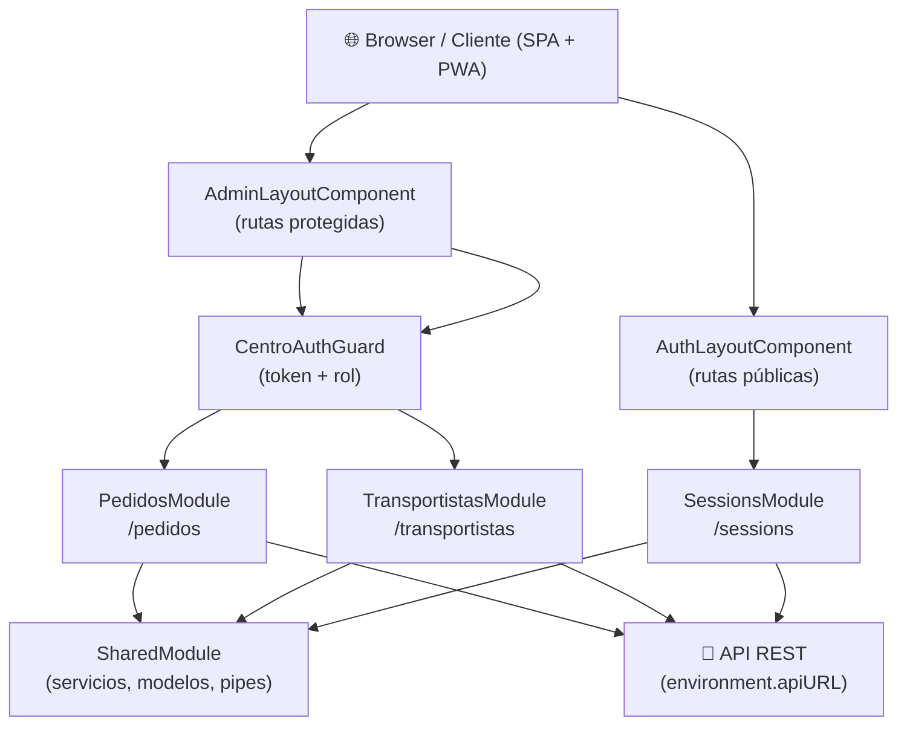

# App Agronomy — `muvin-lite`

> **Stack:** Angular 16 · Angular Material · Bootstrap 5 · ngx-translate · Angular PWA · ApexCharts · ECharts
> **Versión del repo:** `14.2.0`
> **Última revisión:** 2026-04-30

---

> [!info] Propósito
> Aplicación web (SPA/PWA) orientada a operadores de centros agroindustriales. Permite gestionar solicitudes de pedidos (reservas de cupos de granos y fertilizantes), administrar transportistas, choferes y equipos (camiones/acoplados), y hacer seguimiento del estado de despachos. Funciona como frontend liviano desacoplado que consume una API REST externa.

---

## 🗂️ Módulos Principales

| # | Módulo | Descripción breve | Criticidad | Enlace |
|---|--------|-------------------|------------|--------|
| 1 | Sessions | Autenticación, login, recupero de contraseña, perfil | 🔴 Alta | [[modulo-sessions]] |
| 2 | Pedidos | Gestión de reservas, cupos, asignación de choferes y despacho | 🔴 Alta | [[modulo-pedidos]] |
| 3 | Transportistas | ABM de transportistas, choferes, camiones y acoplados | 🟡 Media | [[modulo-transportistas]] |
| 4 | Shared | Guards, interceptors, servicios globales, modelos, pipes, layouts | 🟢 Baja | [[modulo-shared]] |

---

## 🔗 Inventarios Rápidos

- [[tree-estructura-archivos]] — Árbol completo del proyecto
- [[cross-module-dependencies]] — Grafo de dependencias entre módulos
- [[depends-matrix]] — Matriz NxN de dependencias
- [[functional-classification]] — Clasificación funcional de cada módulo
- [[core-vs-custom-dependencies]] — Dependencias core vs. customizaciones
- [[security-inventory]] — Inventario de seguridad y hallazgos
- [[data-files-index]] — Índice de archivos de datos y configuración

---

## 🏗️ Arquitectura de Alto Nivel

---

## 📐 Convenciones de la Documentación

| Ícono | Significado |
|-------|-------------|
| 🟢 | Sano / Bajo riesgo |
| 🟡 | Atención / Riesgo medio |
| 🔴 | Crítico / Alto riesgo |
| ⚠️ | Advertencia puntual |
| 🚧 | Sin verificar / en construcción |
| 💀 | Código muerto / sin uso detectado |
| 🔒 | Afecta seguridad |
| 📦 | Dependencia externa |
| 🔄 | Proceso automático / batch |
| 📊 | Reporte / gráfico |

- **Navegación:** todos los enlaces usan sintaxis Obsidian `[[nombre-archivo]]`
- **Diagramas:** Mermaid embebido en bloques de código
- **Rutas de código:** relativas a la raíz del repo `app-agronomy/`
