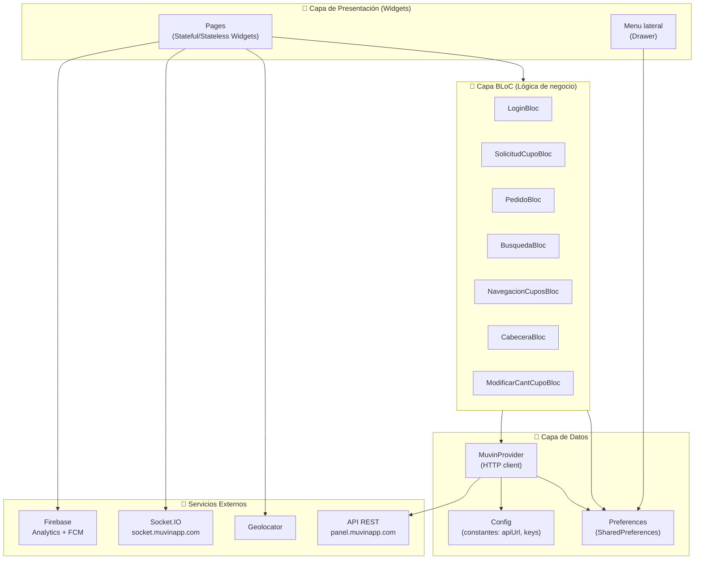
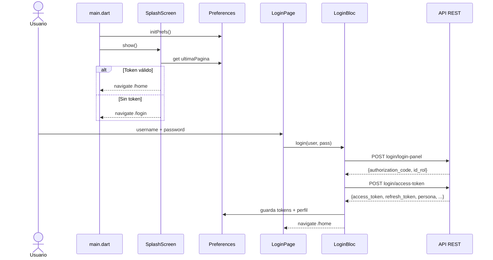

# Arquitectura de Alto Nivel — App Clients

> **Última revisión:** 2026-04-30

## Patrón arquitectónico

La app sigue el patrón **BLoC (Business Logic Component)** con **RxDart** para streams reactivos. La capa de UI consume BLoCs inyectados vía `Provider` (propio, no el paquete). Los BLoCs delegan las llamadas HTTP a `MuvinProvider`.

## Ciclo de vida de autenticación

## Gestión de tokens

- **Access Token:** JWT guardado en `SharedPreferences` (clave `access_token`). Se envía en header `Authorization: Bearer <token>`.
- **Refresh Token:** guardado en `SharedPreferences` (clave `refresh_token`). Se usa automáticamente cuando el backend devuelve `401`.
- **X-Api-Key:** hardcodeada en `Config.xApiKey`. Se envía en todas las peticiones autenticadas.

> [!danger] Riesgo de seguridad
> `Config.dart` contiene la API key, server token de FCM y URL de WebSocket **hardcodeados en el código fuente**. Ver [[security-inventory]].
