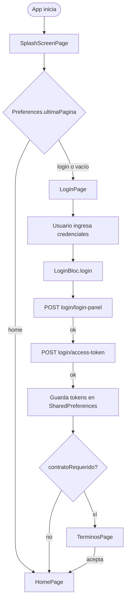

# Módulo: Auth / Login

> **Ruta/Namespace:** `lib/src/pages/login_page.dart`, `lib/src/pages/splashscreen_page.dart`
> **Criticidad:** 🔴 Alta
> **Estado:** Activo

## Propósito

Gestiona el ciclo completo de autenticación: splash screen inicial, login con usuario/contraseña, obtención de tokens (access + refresh), almacenamiento de perfil del usuario y aceptación de términos y condiciones. Es la puerta de entrada obligatoria a la app.

## Funcionalidades que expone

| # | Funcionalidad | Descripción breve | Detalle |
|---|--------------|-------------------|---------|
| 1.1 | Splash Screen | Pantalla inicial; decide si va a login o home según token | [auth-splashscreen](../02-funcionalidades/auth-splashscreen.md) |
| 1.2 | Login | Autenticación con usuario + contraseña | [auth-login](../02-funcionalidades/auth-login.md) |
| 1.3 | Términos y condiciones | Pantalla de aceptación de T&C | [auth-terminos](../02-funcionalidades/auth-terminos.md) |

## Dependencias

- **Depende de:** [modulo-core](./modulo-core.md) (`MuvinProvider`, `Preferences`, `Config`)
- **Depende de:** [modulo-blocs](./modulo-blocs.md) (`LoginBloc`)
- **Es usado por:** Todo el sistema (punto de entrada)

## Diagrama de flujo

## Servicios Backend Consumidos

| Verbo | Ruta | Propósito |
|-------|------|-----------|
| POST | `login/login-panel` | Login con credenciales |
| POST | `login/access-token` | Obtener access_token + perfil |
| POST | `login/refresh-token` | Renovar access_token automáticamente |
| PUT | `termino/actualizar` | Aceptar términos y condiciones |

## Datos almacenados en SharedPreferences

| Clave | Descripción |
|-------|-------------|
| `access_token` | JWT de sesión |
| `refresh_token` | Token de renovación |
| `expires_at` | Expiración del access_token |
| `ultimaPagina` | Última ruta navegada |
| `nombre` | Razón social del usuario |
| `personaRol` | ID de persona-rol |
| `esClienteFinal` | Flag cliente final (`0`/`1`) |
| `esDadorCupo` | Flag dador de cupo (`0`/`1`) |
| `clienteMuvin` | Flag cliente Muvin |
| `esDestino` | Flag destinatario (rol `7`) |
| `cuit_cuil` | CUIT/CUIL del usuario |
| `id_persona` | ID de persona |
| `contratoRequerido` | Si debe aceptar T&C |
| `usaMtr` | Flag uso de MTR |

## Riesgos y deuda técnica

- 🔴 `Config.dart` tiene el **captcha hardcodeado** en el método `login()`. Un captcha fijo/vencido romperá el login silenciosamente.
- 🔴 Access token en `SharedPreferences` (no en keystore seguro). En Android puede ser leído con root.
- 🔒 `Config.serverToken` (FCM server token) hardcodeado en código fuente.
- ⚠️ No hay manejo visible de sesión expirada en la UI. El refresh es automático pero silencioso.

## Archivos fuente relevantes

- `lib/src/pages/splashscreen_page.dart`
- `lib/src/pages/login_page.dart`
- `lib/src/pages/terminos_page.dart`
- `lib/src/blocs/login_bloc.dart`
- `lib/src/share/preference.dart`
- `lib/src/config/config.dart`
