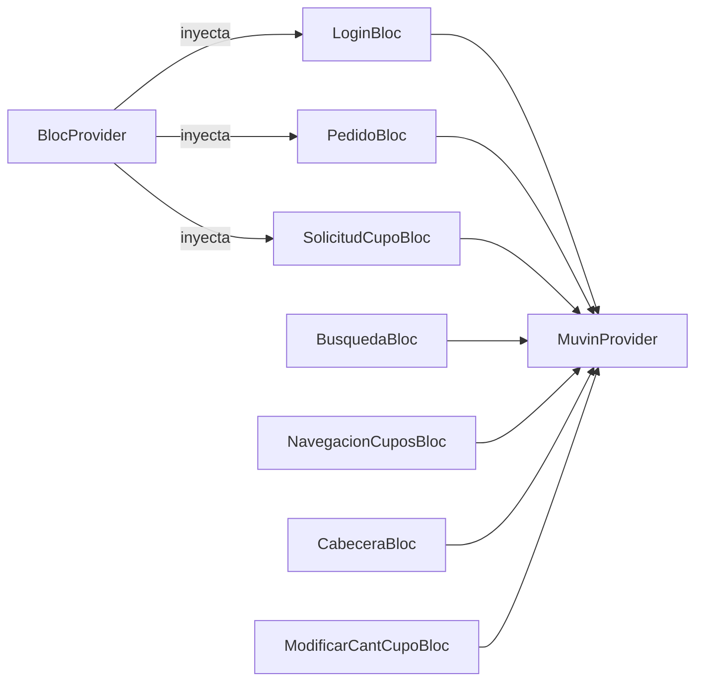

# Módulo: BLoCs (Estado Reactivo)

> **Ruta/Namespace:** `lib/src/blocs/`
> **Criticidad:** 🔴 Alta
> **Estado:** Activo

## Propósito

Capa de lógica de negocio/estado reactivo. Implementa el patrón BLoC (Business Logic Component) usando `RxDart` (`BehaviorSubject`, `PublishSubject`). Cada BLoC expone Streams (salida) y Sinks (entrada) que consumen los Widgets, desacoplando la UI de la lógica.

## BLoCs inventariados

| BLoC | Archivo | Responsabilidad |
|------|---------|-----------------|
| `LoginBloc` | `login_bloc.dart` | Validación de form, llamada login, emisión de token |
| `PedidoBloc` | `pedido_bloc.dart` | Estado de pedidos/cargas; POST pedido, PUT cupo, GET solicitud |
| `BusquedaBloc` | `busqueda_bloc.dart` | Búsqueda de cupos por demandante |
| `SolicitudCupoBloc` | `solicitud_cupo_bloc.dart` | CRUD solicitudes de cupo; asignar, recuperar, listar |
| `NavegacionCuposBloc` | `navegacion_cupos_bloc.dart` | Manejo de la navegación/paginación dentro de cupos |
| `CabeceraBloc` | `cabecera_bloc.dart` | Selección de cabeceras disponibles (GET `v3/cabecera/select`) |
| `ModificarCantCupoBloc` | `modificar_cant_cupo_bloc.dart` | Variar cantidad de una demanda de cupo |
| `Validators` | `validators.dart` | Transformadores RxDart: email, required, numeric |
| `BlocProvider` | `provider.dart` | InheritedWidget genérico para inyección de BLoC en el árbol |

## Patrón BLoC aplicado

```
Widget
  │  (listen)
  ▼
Stream<T>   ◄──── BLoC ◄──── Sink<S>  ◄──── Widget (event)
                    │
                    └──── MuvinProvider (HTTP)
```

Cada BLoC:
1. Expone `Stream<T>` para que la UI escuche con `StreamBuilder`
2. Expone `Sink<S>` / funciones para que la UI dispare acciones
3. Llama a `MuvinProvider` para operaciones HTTP
4. Cierra los subjects en `dispose()`

## Detalle por BLoC

### LoginBloc
```dart
// Streams
Stream<String> get emailStream    // error de validación email
Stream<String> get passStream     // error de validación password
Stream<bool>   get formValidStream // habilita botón submit

// Sinks
Sink<String> get changeEmail
Sink<String> get changePassword

// Método
Future<Map<dynamic,dynamic>> login(String email, String pass)
```

### PedidoBloc
```dart
Stream<List<dynamic>> get pedidosStream   // lista de pedidos/cargas
Stream<dynamic>       get solicitudStream // detalle de solicitud

Future<dynamic> getCuposDisponibles(params)
Future<dynamic> crearPedido(body)
Future<dynamic> pedidoRapido(body)
Future<dynamic> getSolicitud(id)
```

### SolicitudCupoBloc
```dart
Stream<List<dynamic>> get cuposStream          // cupos disponibles
Stream<List<dynamic>> get solicitudesStream    // mis solicitudes
Stream<dynamic>       get operacionStream      // resultado de asignar/recuperar

Future<void> getCuposListado(params)
Future<void> asignarCupo(body)
Future<void> recuperarCupo(body)
Future<void> getSolicitudesPropias(fecha)
Future<void> cargaSolicitud(body)
Future<void> cargaSolicitudDistribuida(body)
```

### BlocProvider (InheritedWidget)
```dart
class BlocProvider<T extends Object> extends InheritedWidget {
  final T bloc;
  static T of<T>(BuildContext context) { ... }
}
```
Se usa en cada pantalla para obtener el BLoC correcto sin pasar por el constructor.

## Diagrama de relaciones



## Riesgos y deuda técnica

- ⚠️ `dispose()` debe llamarse en `StatefulWidget.dispose()`. Si algún widget no llama a `bloc.dispose()`, los `BehaviorSubject` quedan abiertos → memory leak.
- ⚠️ No hay manejo global de errores HTTP en los BLoCs. Cada BLoC maneja errores localmente; inconsistencias en mensajes al usuario.
- 💀 Dependencia de `rxdart ^0.23.x` (versión antigua). La API de Streams cambió en versiones posteriores.

## Archivos fuente relevantes

- `lib/src/blocs/login_bloc.dart`
- `lib/src/blocs/pedido_bloc.dart`
- `lib/src/blocs/busqueda_bloc.dart`
- `lib/src/blocs/solicitud_cupo_bloc.dart`
- `lib/src/blocs/navegacion_cupos_bloc.dart`
- `lib/src/blocs/cabecera_bloc.dart`
- `lib/src/blocs/modificar_cant_cupo_bloc.dart`
- `lib/src/blocs/validators.dart`
- `lib/src/blocs/provider.dart`
