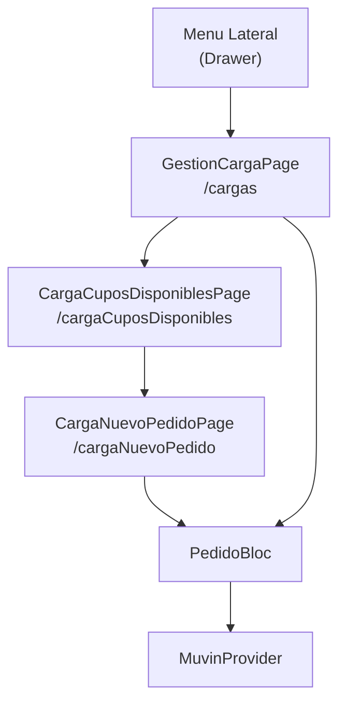

# Módulo: Cargas

> **Ruta/Namespace:** `lib/src/pages/cargas/`, `lib/src/pages/gestion_carga_page.dart`, `lib/src/pages/carga_cupos_disponibles_page.dart`, `lib/src/pages/carga_nuevo_pedido_page.dart`
> **Criticidad:** 🔴 Alta
> **Estado:** Activo

## Propósito

Gestión del proceso de carga de granos. Permite al usuario seleccionar cupos disponibles para asignarles una carga, crear nuevos pedidos de transporte ("pedido rápido"), y hacer seguimiento de las cargas en curso. Es el segundo flujo operacional crítico de la app.

## Funcionalidades que expone

| # | Funcionalidad | Descripción breve | Detalle |
|---|--------------|-------------------|---------|
| 3.1 | Gestión de cargas principal | Landing de cargas; cupos asignados y en curso | [cargas-gestion](../02-funcionalidades/cargas-gestion.md) |
| 3.2 | Cupos disponibles para carga | Listado de cupos disponibles a cargar | [cargas-cupos-disponibles](../02-funcionalidades/cargas-cupos-disponibles.md) |
| 3.3 | Nuevo pedido / carga | Formulario de alta de pedido de transporte | [cargas-nuevo-pedido](../02-funcionalidades/cargas-nuevo-pedido.md) |
| 3.4 | Pedido rápido | Creación de pedido sin asignación previa de cupo | [cargas-pedido-rapido](../02-funcionalidades/cargas-pedido-rapido.md) |

## Dependencias

- **Depende de:** [modulo-core](./modulo-core.md) (`MuvinProvider`)
- **Depende de:** [modulo-blocs](./modulo-blocs.md) (`PedidoBloc`)
- **Es usado por:** [modulo-home](./modulo-home.md) (menú lateral → `/cargas`)
- **Relacionado con:** [modulo-cupos](./modulo-cupos.md) (los cupos asignados alimentan la pantalla de cargas)

## Diagrama de componentes

## Servicios Backend Consumidos

| Verbo | Ruta | Propósito | Detalle |
|-------|------|-----------|---------|
| GET | `v2/cupos/disponibles` | Cupos disponibles para cargar | [cargas-endpoints](../03-servicios-backend/cargas-endpoints.md) |
| POST | `pedido` | Crear nuevo pedido de transporte | [cargas-endpoints](../03-servicios-backend/cargas-endpoints.md) |
| PUT | `cupo/:id` | Asociar entregador a cupo | [cargas-endpoints](../03-servicios-backend/cargas-endpoints.md) |
| POST | `pedido/rapido` | Pedido sin asignación previa de cupo | [cargas-endpoints](../03-servicios-backend/cargas-endpoints.md) |
| GET | `solicitud/:id` | Detalle de solicitud/pedido | [cargas-endpoints](../03-servicios-backend/cargas-endpoints.md) |

## Riesgos y deuda técnica

- ⚠️ `PedidoBloc` acumula estado de múltiples pantallas (cupos, pedidos, etc). Si falla en un punto intermedio del flujo, no hay rollback.
- ⚠️ El endpoint `pedido/rapido` es un atajo que puede saltar validaciones del flujo estándar; revisar si se aplica la misma lógica de negocio.
- 💀 `v2/cupos/disponibles` es una ruta legacy v2 — verificar migración a v3.

## Archivos fuente relevantes

- `lib/src/pages/gestion_carga_page.dart`
- `lib/src/pages/carga_cupos_disponibles_page.dart`
- `lib/src/pages/carga_nuevo_pedido_page.dart`
- `lib/src/pages/cargas/` (archivos de sub-pantallas)
- `lib/src/blocs/pedido_bloc.dart`
