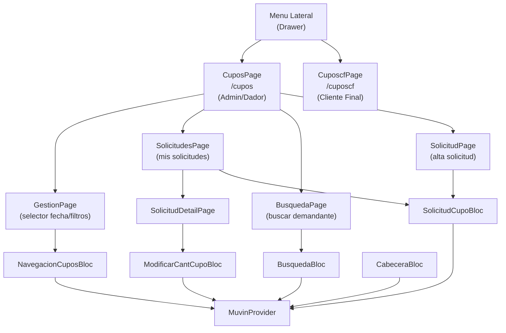

# Módulo: Cupos

> **Ruta/Namespace:** `lib/src/pages/cupos/`, `lib/src/pages/cupos_page.dart`, `lib/src/pages/cuposcf_page.dart`
> **Criticidad:** 🔴 Alta
> **Estado:** Activo

## Propósito

Módulo central de la app. Gestiona la consulta, solicitud y asignación de cupos de granos. Tiene dos variantes según el perfil del usuario: `CuposPage` (administrador de cupos/dador) y `CuposcfPage` (cliente final). Permite buscar cupos disponibles por fecha, producto y zona, solicitar asignaciones, ver solicitudes propias y sus detalles.

## Funcionalidades que expone

| # | Funcionalidad | Descripción breve | Detalle |
|---|--------------|-------------------|---------|
| 2.1 | Cupos disponibles (Admin) | Lista de cupos para administrador/dador | [cupos-disponibles](../02-funcionalidades/cupos-disponibles.md) |
| 2.2 | Cupos disponibles (CF) | Lista de cupos para cliente final | [cupos-cf](../02-funcionalidades/cupos-cf.md) |
| 2.3 | Buscar cupos | Búsqueda de cupos por demandante | [cupos-busqueda](../02-funcionalidades/cupos-busqueda.md) |
| 2.4 | Solicitud de cupo | Alta de nueva solicitud de asignación | [cupos-solicitud](../02-funcionalidades/cupos-solicitud.md) |
| 2.5 | Listado de solicitudes | Mis solicitudes / demandas enviadas | [cupos-solicitudes-lista](../02-funcionalidades/cupos-solicitudes-lista.md) |
| 2.6 | Detalle de solicitud | Detalle y acciones sobre una solicitud | [cupos-solicitud-detalle](../02-funcionalidades/cupos-solicitud-detalle.md) |
| 2.7 | Modificar cantidad de cupo | Variar cantidad de una demanda | [cupos-modificar-cant](../02-funcionalidades/cupos-modificar-cant.md) |

## Dependencias

- **Depende de:** [modulo-core](./modulo-core.md) (`MuvinProvider`)
- **Depende de:** [modulo-blocs](./modulo-blocs.md) (`SolicitudCupoBloc`, `BusquedaBloc`, `NavegacionCuposBloc`, `ModificarCantCupoBloc`, `CabeceraBloc`)
- **Es usado por:** [modulo-home](./modulo-home.md) (menú lateral → `/cupos`, `/cuposcf`)

## Diagrama de componentes

## Servicios Backend Consumidos

| Verbo | Ruta | Propósito | Detalle |
|-------|------|-----------|---------|
| GET | `v3/cupo/disponibles` | Cupos disponibles (cliente final) | [cupos-endpoints](../03-servicios-backend/cupos-endpoints.md#GET-v3-cupo-disponibles) |
| GET | `v3/cupo/listado` | Cupos disponibles (admin) | [cupos-endpoints](../03-servicios-backend/cupos-endpoints.md#GET-v3-cupo-listado) |
| GET | `v2/cupos/buscar-x-demandante` | Buscar cupos por demandante | [cupos-endpoints](../03-servicios-backend/cupos-endpoints.md) |
| POST | `v3/cupo/asignar` | Asignar cupo a demandante | [cupos-endpoints](../03-servicios-backend/cupos-endpoints.md#POST-asignar) |
| POST | `v3/cupo/asignar2` | Asignar cupo (variante) | [cupos-endpoints](../03-servicios-backend/cupos-endpoints.md) |
| POST | `v3/cupo/recuperar` | Recuperar cupo asignado | [cupos-endpoints](../03-servicios-backend/cupos-endpoints.md) |
| POST | `v3/cupo/carga-solicitud` | Solicitud de carga simple | [cupos-endpoints](../03-servicios-backend/cupos-endpoints.md) |
| POST | `v3/cupo/carga-solicitud-distribuida` | Solicitud distribuida | [cupos-endpoints](../03-servicios-backend/cupos-endpoints.md) |
| GET | `v2/cupos/demandados/:fecha` | Solicitudes propias por fecha | [cupos-endpoints](../03-servicios-backend/cupos-endpoints.md) |
| GET | `demanda-cupo/by-demandante` | Demandas del demandante (rango fechas) | [cupos-endpoints](../03-servicios-backend/cupos-endpoints.md) |
| POST | `demanda-cupo/variar-cantidad` | Variar cantidad de demanda | [cupos-endpoints](../03-servicios-backend/cupos-endpoints.md) |
| PUT | `v3/cupo/:id` | Asociar entregador a cupo | [cupos-endpoints](../03-servicios-backend/cupos-endpoints.md) |
| GET | `v3/cabecera/select` | Cabeceras disponibles | [cupos-endpoints](../03-servicios-backend/cupos-endpoints.md) |
| GET | `v3/ccpp/:id` | Datos de CCPP | [cupos-endpoints](../03-servicios-backend/cupos-endpoints.md) |

## Riesgos y deuda técnica

- ⚠️ La distinción entre `CuposPage` y `CuposcfPage` se basa en flags de `SharedPreferences`. Si el backend cambia los perfiles, la UI no se actualiza sin re-login.
- ⚠️ Los parámetros de filtro se construyen por concatenación de strings en `getCuposDisponibles()`. Ver [security-inventory](../05-inventarios/security-inventory.md).
- 💀 `v2/cupos/buscar-x-demandante` usa ruta v2. Verificar si el backend la mantiene activa o fue migrado a v3.

## Archivos fuente relevantes

- `lib/src/pages/cupos_page.dart`
- `lib/src/pages/cuposcf_page.dart`
- `lib/src/pages/cupos/gestion_page.dart`
- `lib/src/pages/cupos/solicitudes_page.dart`
- `lib/src/pages/cupos/solicitud_page.dart`
- `lib/src/pages/cupos/solicitud_detail_page.dart`
- `lib/src/pages/cupos/busqueda_page.dart`
- `lib/src/blocs/solicitud_cupo_bloc.dart`
- `lib/src/blocs/busqueda_bloc.dart`
- `lib/src/blocs/navegacion_cupos_bloc.dart`
- `lib/src/blocs/modificar_cant_cupo_bloc.dart`
- `lib/src/blocs/cabecera_bloc.dart`
