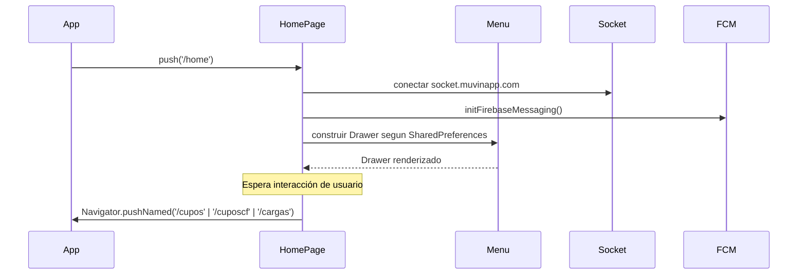

# Módulo: Home

> **Ruta/Namespace:** `lib/src/pages/home_page.dart`, `lib/src/menu/`
> **Criticidad:** 🟡 Media
> **Estado:** Activo

## Propósito

Pantalla principal post-login. Actúa como hub de navegación: presenta el `Drawer` (menú lateral) con accesos a los módulos de Cupos y Cargas según el perfil del usuario autenticado. Inicializa la conexión WebSocket y la escucha de notificaciones push (FCM).

## Funcionalidades que expone

| # | Funcionalidad | Descripción |
|---|--------------|-------------|
| 4.1 | Menú lateral (Drawer) | Navegación a Gestión Cupos, Gestión Cargas, Salir |
| 4.2 | Menú contextual por perfil | Items condicionales: `esDadorCupo` muestra gestión admin; `esClienteFinal` muestra vista CF |
| 4.3 | Inicializar Socket.IO | Conecta a `socket.muvinapp.com` para notificaciones en tiempo real |
| 4.4 | Escucha FCM | Manejo de notificaciones push con Firebase Messaging |
| 4.5 | AppBar con avatar/usuario | Muestra nombre del usuario logueado |

## Perfil de usuario y menú

La visibilidad de ítems del menú depende de dos flags almacenados en `SharedPreferences`:

| Flag | Valor | Menús visibles |
|------|-------|----------------|
| `esDadorCupo = true` | Admin/Dador | "Gestión Cupos" → `/cupos` |
| `esClienteFinal = true` | Cliente Final | "Gestión Cupos CF" → `/cuposcf` |
| Cualquiera | Todos | "Gestión Cargas" → `/cargas` |
| — | — | "Salir" (logout) |

## Dependencias

- **Depende de:** [modulo-auth](./modulo-auth.md) (requiere estar autenticado; usa datos de `Preference`)
- **Navega hacia:** [modulo-cupos](./modulo-cupos.md), [modulo-cargas](./modulo-cargas.md)
- **Depende de:** [modulo-core](./modulo-core.md) (Socket.IO, FCM)

## Diagrama de flujo

## Riesgos y deuda técnica

- ⚠️ La conexión Socket.IO se inicia en `initState` sin manejo de error/reconexión visible. Si el servidor WebSocket no responde, la app no informa al usuario.
- ⚠️ El logout ("Salir") debe limpiar `SharedPreferences` y desconectar el socket. Verificar que la secuencia sea correcta para evitar fugas de sesión.

## Archivos fuente relevantes

- `lib/src/pages/home_page.dart`
- `lib/src/menu/menu.dart`
- `lib/src/menu/menu_item.dart` (si existe)
- `lib/main.dart` (inicialización global de Socket y FCM)
