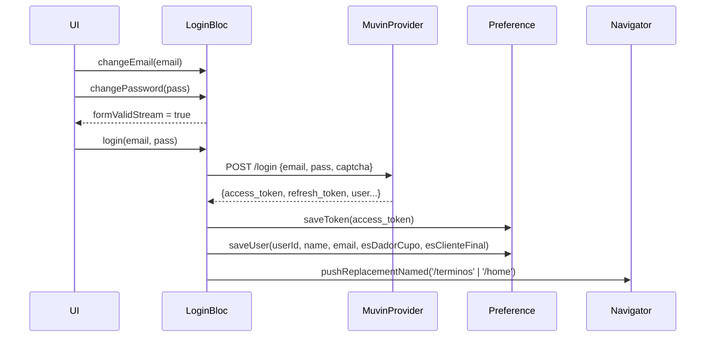

# F-02 · Login con Email y Contraseña

> **Módulo:** [modulo-auth](../01-modulos/modulo-auth.md)
> **Ruta:** `/login`

## Descripción

Pantalla de login con campos email y contraseña. Usa `LoginBloc` + `Validators` (RxDart) para validación reactiva en tiempo real. El botón "Ingresar" solo se habilita si ambos campos son válidos.

## Campos del formulario

| Campo | Validación | BLoC Sink |
|-------|-----------|-----------|
| Email | formato email válido | `LoginBloc.changeEmail` |
| Contraseña | no vacío, mínimo 6 caracteres | `LoginBloc.changePassword` |

## Flujo técnico



## Payload enviado al backend

```json
{
  "email": "usuario@example.com",
  "password": "••••••••",
  "captcha": "HARDCODED_STRING"
}
```

> 🔴 El campo `captcha` contiene un string hardcodeado en `MuvinProvider.login()`. Estará vencido en producción.

## Datos persistidos en SharedPreferences tras login exitoso

- `access_token`, `refresh_token`
- `userId`, `userName`, `userEmail`
- `esDadorCupo` (bool), `esClienteFinal` (bool)

## Riesgos

- 🔴 Captcha hardcodeado invalida la protección anti-bot.
- ⚠️ No hay mecanismo de "recordar sesión" explícito; el token se guarda siempre.
- ⚠️ No hay flujo de recuperación de contraseña en la app.
