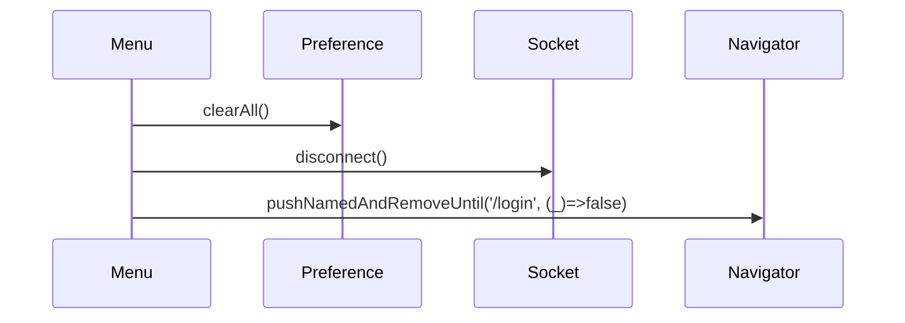

# F-04 · Logout y Limpieza de Sesión

> **Módulo:** [modulo-home](../01-modulos/modulo-home.md)
> **Trigger:** Ítem "Salir" en menú lateral

## Descripción

El usuario presiona "Salir" en el Drawer. La app limpia todos los datos de sesión de `SharedPreferences`, desconecta el socket y navega a `/login` eliminando el historial de navegación.

## Flujo

## Datos limpiados

- `access_token`, `refresh_token`
- `userId`, `userName`, `userEmail`
- `esDadorCupo`, `esClienteFinal`
- `terminosAceptados`
- `fcmToken` (opcional — depende de implementación)

## Riesgos

- ⚠️ No se invalida el token en el backend (no hay llamada a un endpoint `/logout`). El token sigue siendo válido en el servidor hasta su expiración.
