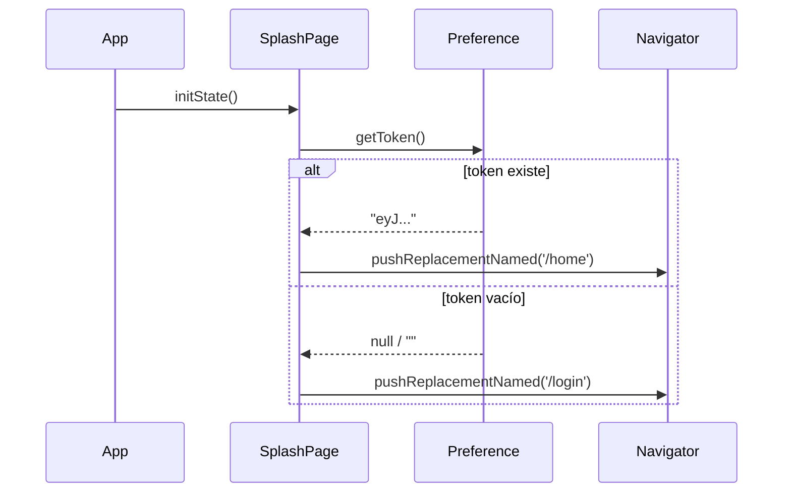

# F-01 · Splash Screen y Auto-login

> **Módulo:** [modulo-auth](../01-modulos/modulo-auth.md)
> **Ruta de entrada:** `/` (ruta inicial de la app)

## Descripción

Al iniciar la app se muestra una pantalla de splash (`SplashPage`) que:
1. Muestra el logo de Muvin durante ~1-2 segundos.
2. Lee el `access_token` de `SharedPreferences` (vía `Preference`).
3. Si existe token → navega automáticamente a `/home` (auto-login).
4. Si no existe token → navega a `/login`.

No se valida el token contra el backend en este punto. Si el token está vencido, el usuario llega a Home y el primer request fallará silenciosamente.

## Flujo

## Riesgos

- ⚠️ Token no se valida en el servidor. Un token expirado hace que el usuario llegue a Home con sesión rota.
