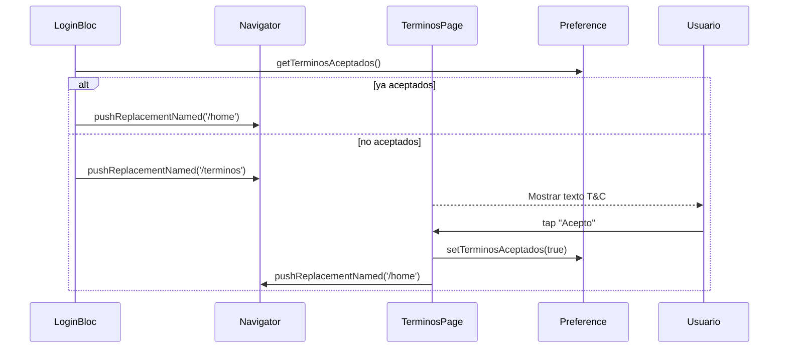

# F-03 · Aceptación de Términos y Condiciones

> **Módulo:** [modulo-auth](../01-modulos/modulo-auth.md)
> **Ruta:** `/terminos`

## Descripción

Pantalla presentada en el primer ingreso. Muestra el texto de Términos y Condiciones y requiere que el usuario los acepte explícitamente para poder continuar a `/home`. Si el usuario ya los aceptó (flag en `SharedPreferences`), la pantalla se omite.

## Flujo

## Riesgos

- ⚠️ Si se actualizan los T&C en el backend, la app no tiene mecanismo para forzar una nueva aceptación (no hay versión de T&C guardada, solo un booleano).
