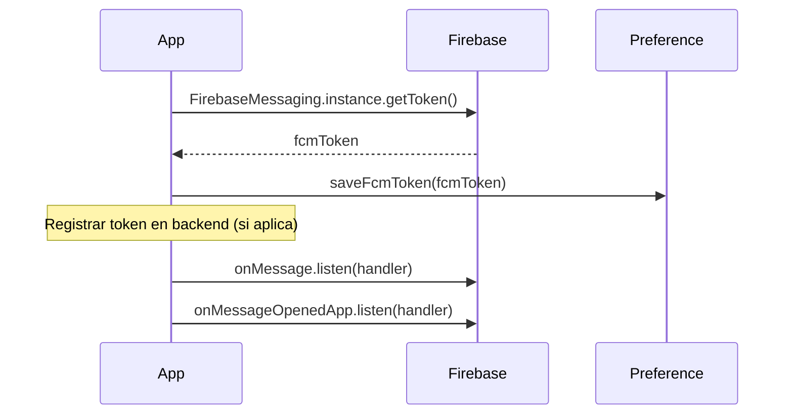

# F-17 · Notificaciones Push (FCM)

> **Módulo:** [modulo-home](../01-modulos/modulo-home.md)

## Descripción

La app usa Firebase Cloud Messaging para recibir notificaciones push en segundo plano y primer plano. Se inicializa en `main.dart` y el handler actualiza el estado de la app si está en primer plano.

## Flujo de inicialización

## Tipos de notificación esperados

| Evento | Acción en app |
|--------|--------------|
| Nueva solicitud aprobada | Snackbar + reload cupos |
| Cambio de estado de pedido | Reload cargas |
| Mensaje genérico | Snackbar informativo |

## Riesgos

- 🔴 `Config.serverToken` (FCM server token) está hardcodeado en código fuente. Cualquiera con acceso al código puede enviar notificaciones push a todos los usuarios. Ver [security-inventory](../05-inventarios/security-inventory.md).
- ⚠️ `firebase_messaging ^6.x` es una versión muy antigua (pre-null-safety, pre-FlutterFire unificado).
