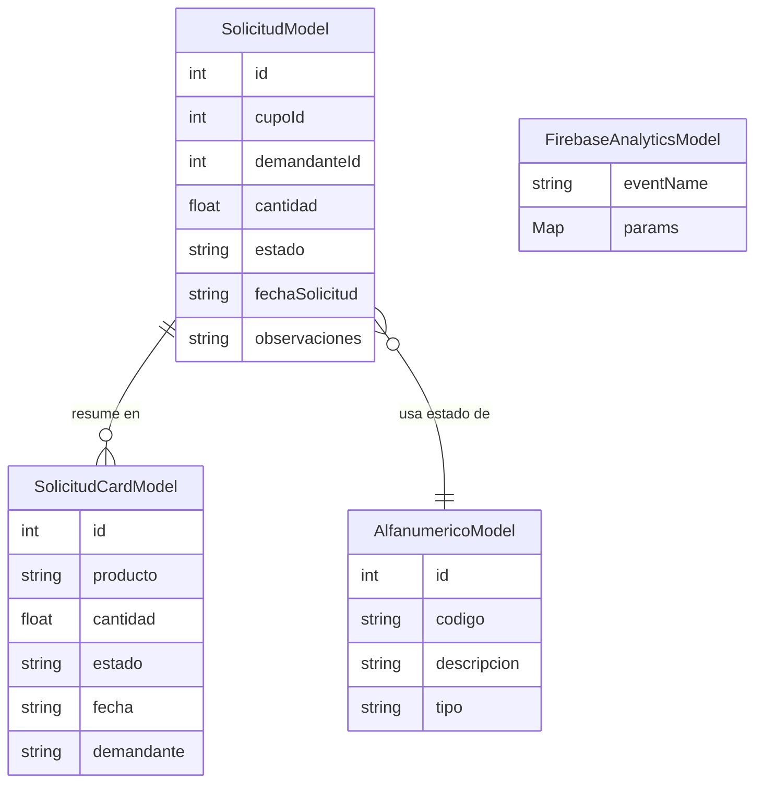

# Índice de Entidades y Modelos de Datos — app-clients

> [[README]] · [[_indice-servicios]]

## Modelos inventariados

| Modelo | Archivo fuente | Descripción | Doc |
|--------|---------------|-------------|-----|
| `SolicitudModel` | `models/solicitud_model.dart` | Solicitud de cupo completa | [solicitud-model](./solicitud-model.md) |
| `SolicitudCardModel` | `models/solicitud_card_model.dart` | Tarjeta resumida de solicitud | [solicitud-card-model](./solicitud-card-model.md) |
| `AlfanumericoModel` | `models/alfanumerico_model.dart` | Ítem de catálogo genérico | [alfanumerico-model](./alfanumerico-model.md) |
| `FirebaseAnalyticsModel` | `models/firebase_analytics_model.dart` | Evento de analytics | [firebase-analytics-model](./firebase-analytics-model.md) |

## Diagrama de relaciones

