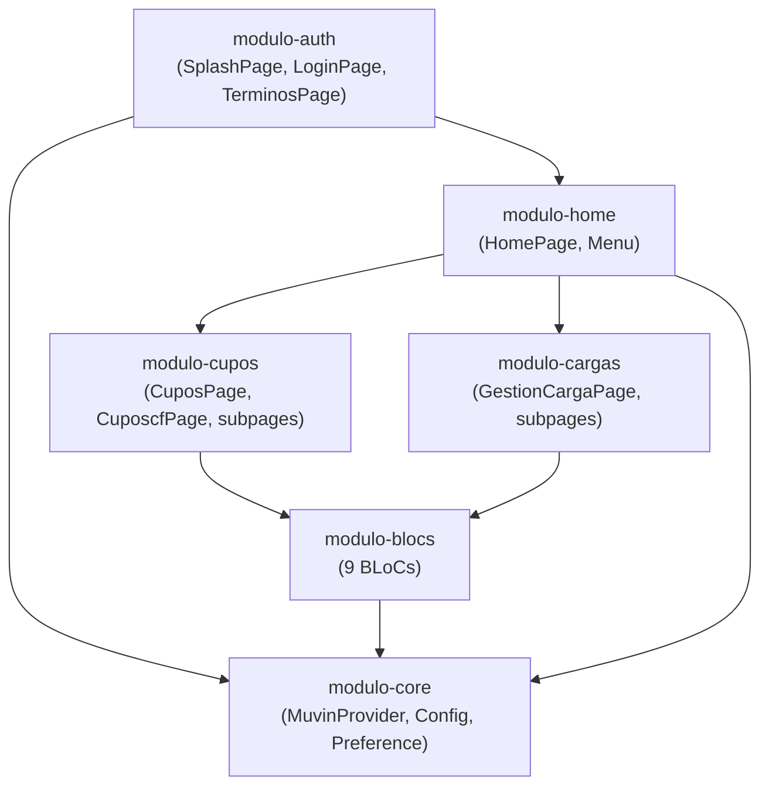

# Dependencias Cross-Módulo — app-clients

> [[README]] · [[tree-estructura-archivos]]

## Mapa de dependencias entre módulos

## Tabla de dependencias directas

| Módulo consumidor | Módulo proveedor | Qué usa |
|-------------------|-----------------|---------|
| `modulo-auth` | `modulo-core` | `MuvinProvider.login()`, `Preference.saveToken()` |
| `modulo-home` | `modulo-auth` | Datos de sesión (`Preference`) |
| `modulo-home` | `modulo-core` | Socket, FCM |
| `modulo-cupos` | `modulo-blocs` | `SolicitudCupoBloc`, `BusquedaBloc`, `NavBloc`, `CabeceraBloc`, `ModifBloc` |
| `modulo-cupos` | `modulo-core` | `MuvinProvider` (indirecto vía BLoCs) |
| `modulo-cargas` | `modulo-blocs` | `PedidoBloc` |
| `modulo-cargas` | `modulo-core` | `MuvinProvider` (indirecto) |
| `modulo-blocs` | `modulo-core` | `MuvinProvider`, `Config`, `Preference` |

## Acoplamiento crítico

- `modulo-core` es una dependencia de **todos** los demás módulos. Un cambio en `Config.apiUrl` o en la firma de `MuvinProvider` impacta toda la app.
- `BlocProvider` (InheritedWidget) es el único mecanismo de inyección. No hay contenedor DI formal.
