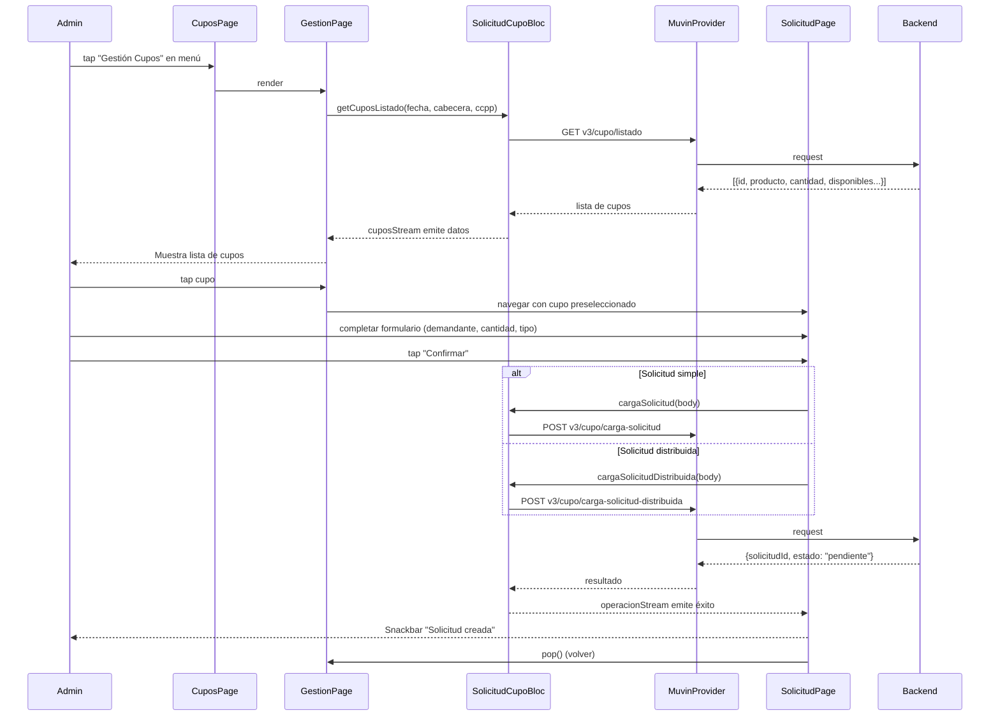

# Flujo: Asignación de Cupo

> [[_indice-flujos]] | Módulo: [[modulo-cupos]]

## Descripción

Flujo completo desde que el Admin/Dador ingresa al módulo de Cupos hasta que confirma una solicitud de asignación.

## Diagrama de flujo

## Variantes del flujo

| Variante | Trigger | Endpoint |
|----------|---------|----------|
| Solicitud simple | 1 demandante, 1 cantidad | `POST v3/cupo/carga-solicitud` |
| Solicitud distribuida | múltiples demandantes | `POST v3/cupo/carga-solicitud-distribuida` |
| Asignación directa | Admin ya conoce al demandante | `POST v3/cupo/asignar` / `asignar2` |
| Recuperar cupo | Revertir asignación previa | `POST v3/cupo/recuperar` |
