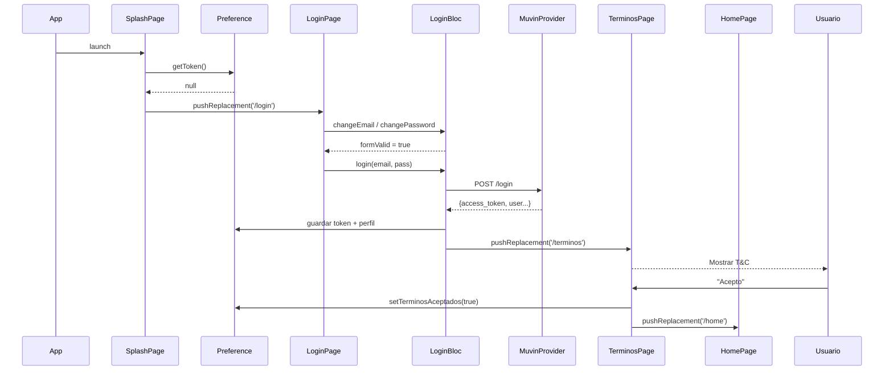
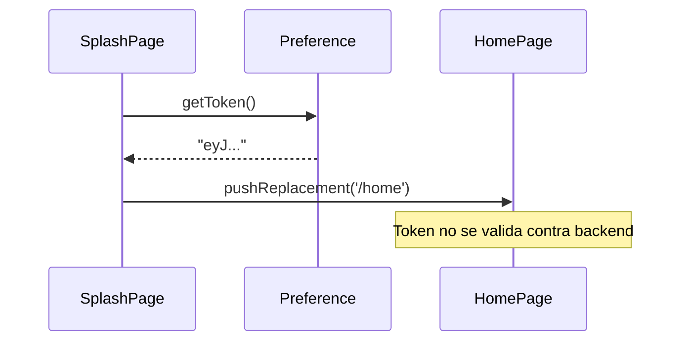
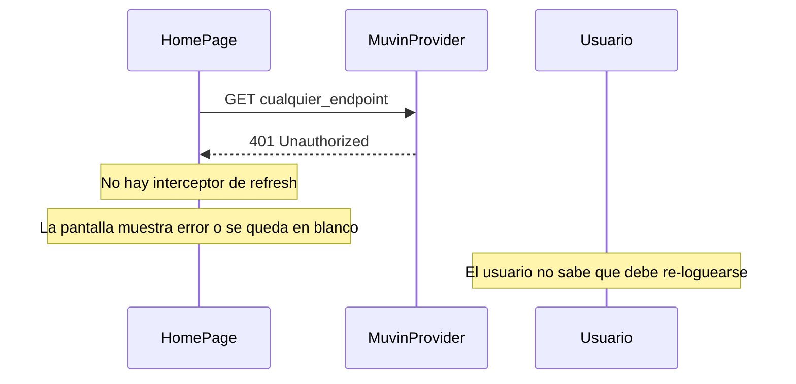

# Flujo: Autenticación Completa

> [[_indice-flujos]] | Módulos: [[modulo-auth]] → [[modulo-home]]

## Descripción

Flujo completo desde el inicio de la app hasta el acceso al contenido principal. Cubre tres escenarios: primer ingreso, re-ingreso con token válido, y sesión expirada.

## Escenario 1: Primer ingreso



## Escenario 2: Re-ingreso con token válido



## Escenario 3: Sesión expirada (token inválido)



> 🔴 El escenario 3 es un problema de UX y seguridad. No hay redirección automática a `/login` cuando el token expira.

## Estados de datos al finalizar login exitoso

```
SharedPreferences:
  access_token    = "eyJ..."
  refresh_token   = "eyJ..."
  userId          = "42"
  userName        = "Juan Pérez"
  userEmail       = "juan@example.com"
  esDadorCupo     = true / false
  esClienteFinal  = true / false
  terminosAceptados = true
```
