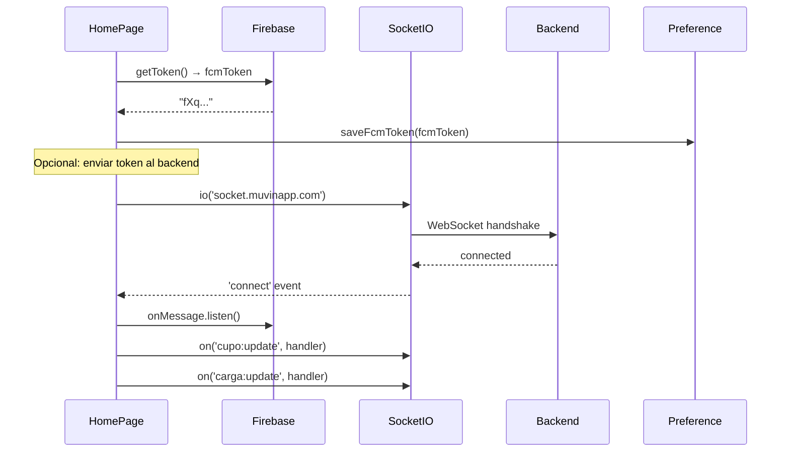
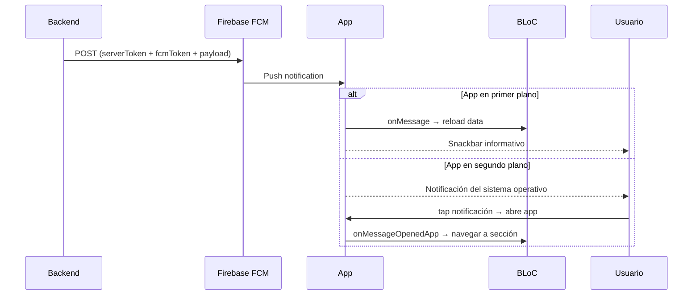
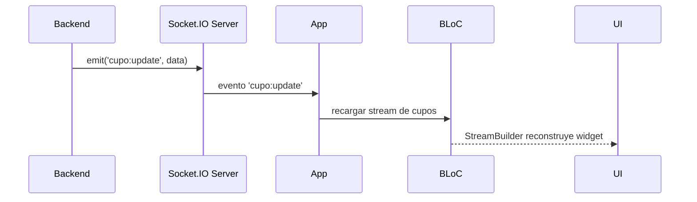

# Flujo: Notificaciones y Tiempo Real

> [[_indice-flujos]] | Módulo: [[modulo-home]] | Funcionalidades: [[home-notificaciones]] · [[home-socket]]

## Descripción

Dos canales paralelos de comunicación servidor → cliente: Firebase Cloud Messaging (push) para notificaciones y Socket.IO para actualizaciones en tiempo real.

## Inicialización al abrir HomePage

## Flujo de notificación push (FCM)

## Flujo de actualización por Socket.IO

## Riesgos

| Riesgo | Severidad |
|--------|-----------|
| Server token FCM hardcodeado → envío no autorizado de push | 🔴 Crítico |
| Sin reconexión automática del socket | ⚠️ Medio |
| FCM library ^6.x incompatible con Flutter 3.x | 🔴 Bloquea upgrade |
