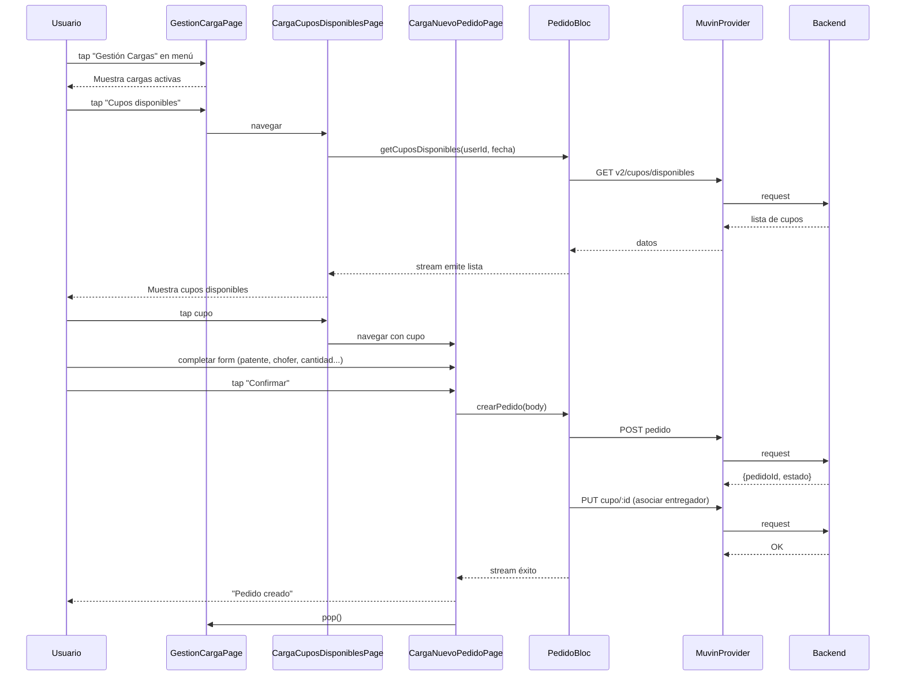
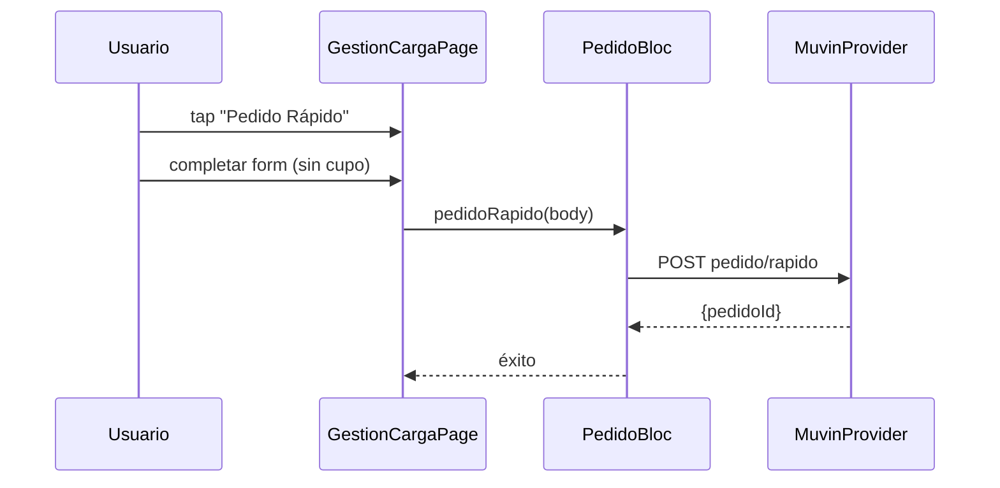

# Flujo: Creación de Pedido de Carga

> [[_indice-flujos]] | Módulo: [[modulo-cargas]]

## Descripción

Flujo desde que el usuario accede a Gestión de Cargas hasta confirmar la creación de un pedido de transporte vinculado a un cupo.

## Diagrama de flujo

## Flujo alternativo: Pedido Rápido

## Riesgo: pedido huérfano

Si `POST pedido` tiene éxito pero `PUT cupo/:id` falla, existe un pedido sin cupo asociado. No hay rollback ni reintentos automáticos.
