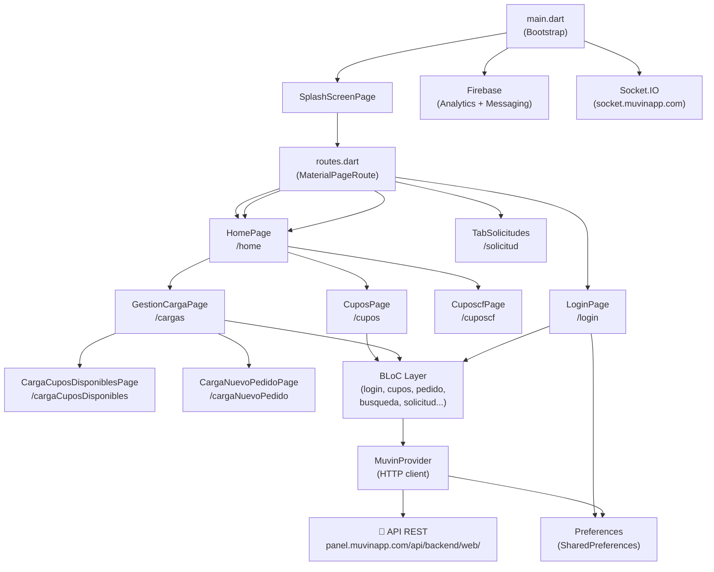

# App Clients — `muvinapp_clientes`

> **Stack:** Flutter 2.x · Dart · BLoC Pattern · Firebase (Analytics + Messaging) · HTTP · Socket.IO
> **Versión:** `1.0.0+2`
> **Última revisión:** 2026-04-30

---

> [!info] Propósito
> Aplicación móvil (Android/iOS) orientada a **clientes y dadores de cupo** del ecosistema Muvin. Permite gestionar cupos disponibles de granos, crear solicitudes de carga, asignar cupos a demandantes y hacer seguimiento de pedidos. Funciona como frontend móvil que consume la misma API REST de la plataforma Muvin.

---

## 🗂️ Módulos Principales

| # | Módulo | Descripción breve | Criticidad | Enlace |
|---|--------|-------------------|------------|--------|
| 1 | [Auth / Login](./01-modulos/modulo-auth.md) | Autenticación, tokens, splash screen | 🔴 Alta | [[modulo-auth]] |
| 2 | [Cupos](./01-modulos/modulo-cupos.md) | Gestión de cupos: consulta, asignación, solicitudes | 🔴 Alta | [[modulo-cupos]] |
| 3 | [Cargas](./01-modulos/modulo-cargas.md) | Nuevo pedido de carga, cupos disponibles de carga | 🟡 Media | [[modulo-cargas]] |
| 4 | [Home](./01-modulos/modulo-home.md) | Pantalla principal, menú lateral | 🟡 Media | [[modulo-home]] |
| 5 | [BLoCs / Estado](./01-modulos/modulo-blocs.md) | Gestión de estado reactivo (BLoC + RxDart) | 🟢 Baja | [[modulo-blocs]] |
| 6 | [Core / Shared](./01-modulos/modulo-core.md) | Provider HTTP, preferencias, configuración, conectividad | 🟢 Baja | [[modulo-core]] |

---

## 🔗 Inventarios Rápidos

- [Árbol de archivos](./05-inventarios/tree-estructura-archivos.md) — Estructura completa del proyecto
- [Dependencias entre módulos](./05-inventarios/cross-module-dependencies.md) — Grafo de dependencias
- [Matriz de dependencias](./05-inventarios/depends-matrix.md) — Matriz NxN
- [Clasificación funcional](./05-inventarios/functional-classification.md) — Tipos por módulo
- [Core vs. custom](./05-inventarios/core-vs-custom-dependencies.md) — Paquetes pub.dev
- [Inventario de seguridad](./05-inventarios/security-inventory.md) — Hallazgos y riesgos
- [Índice de datos](./05-inventarios/data-files-index.md) — Configs y assets

---

## 🏗️ Arquitectura de Alto Nivel

---

## 📐 Convenciones de la Documentación

| Ícono | Significado |
|-------|-------------|
| 🟢 | Sano / Bajo riesgo |
| 🟡 | Atención / Riesgo medio |
| 🔴 | Crítico / Alto riesgo |
| ⚠️ | Advertencia puntual |
| 🚧 | Sin verificar |
| 💀 | Código muerto |
| 🔒 | Afecta seguridad |
| 📦 | Dependencia externa |

- **Navegación Obsidian:** `[[nombre-archivo]]`
- **Navegación Markdown estándar (clickeable):** `[texto](./ruta/archivo.md)`
- **Rutas de código:** relativas a `app-clients/lib/`
