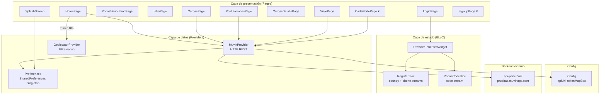

# Arquitectura de Alto Nivel — app-drivers

> [[vision-general]] | [[stack-tecnologico]]

## Diagrama de capas

## Patrón arquitectónico

La app usa un **BLoC manual con InheritedWidget** (sin `flutter_bloc` ni `provider` package). Solo el flujo de login tiene BLoC; el resto de pantallas acceden directamente a `MuvinProvider` sin gestión de estado reactiva.

## Routing

Routing **nombrado** gestionado por `routes.dart` con transición `FadeTransition`. Las rutas disponibles son:

| Ruta | Page |
|------|------|
| `/` (default) | `HomePage` |
| `/login` o `/logout` | `LoginPage` |
| `/phoneverification` | `PhoneVerificationPage` |
| `/signup` | `SignupPage` (vacía) |
| `/intro` | `IntroPage` |
| `/home` | `HomePage` |
| `/cargas` | `CargasPage` |
| `/cargasdetalle` | `CargasDetallePage` |
| `/postulaciones` | `PostulacionesPage` |
| `/viaje` | `ViajePage` |
| `/cartaporte` | `CartaPortePage` (rota) |
