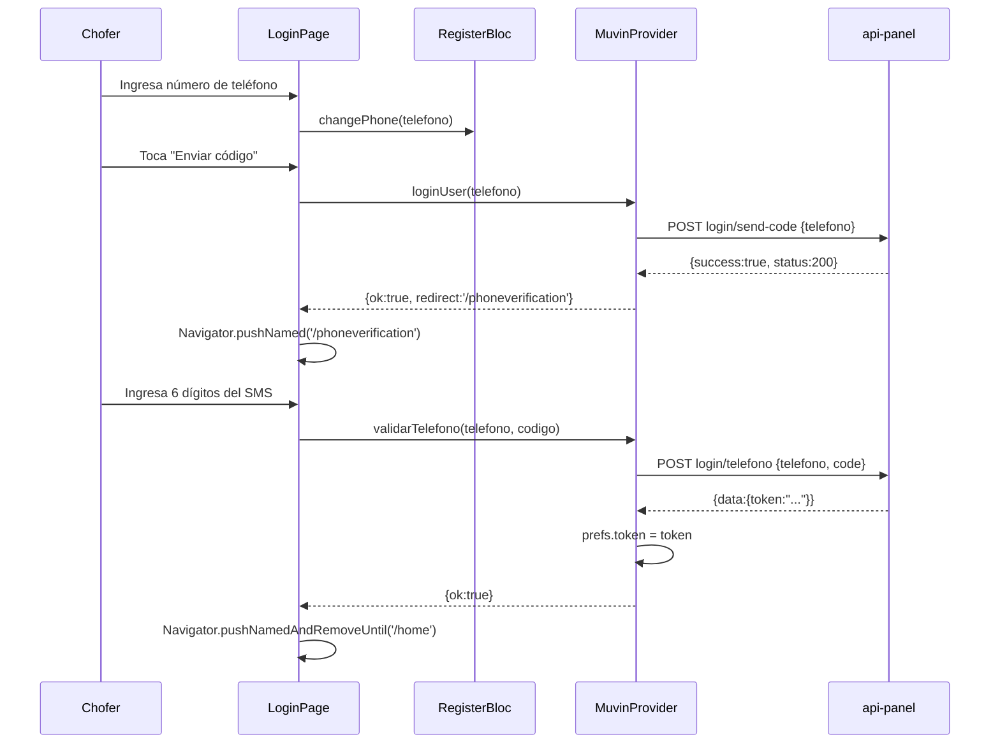

# Módulo: Autenticación (Login + PhoneVerification)

> **Rutas:** `lib/src/pages/login_page.dart`, `lib/src/pages/phoneverification_page.dart`
> **Criticidad:** 🔴 Alta
> **Estado:** Activo

## Propósito

Autenticación del chofer por número de teléfono en dos pasos:
1. El chofer ingresa su número → el backend envía un código SMS.
2. El chofer ingresa el código → el backend devuelve el token Bearer.

## Componentes

| Archivo | Rol |
|---------|-----|
| `login_page.dart` | Formulario de ingreso de teléfono con selección de código de país |
| `phoneverification_page.dart` | Campo de 6 dígitos para el código SMS |
| `blocs/register_bloc.dart` | BLoC con validación reactiva del formulario |
| `blocs/phonecode_bloc.dart` | BLoC para el código de verificación |
| `blocs/provider.dart` | InheritedWidget que provee ambos BLoCs |

## Flujo

## Endpoints consumidos

| Verbo | Ruta | Detalle |
|-------|------|---------|
| POST | `login/send-code` | Envía código SMS al teléfono |
| POST | `login/telefono` | Valida código y devuelve token |

## Dependencias

- **Depende de:** [[modulo-muvin-provider]], [[modulo-blocs]]
- **Es usado por:** [[modulo-splashscreen]] (redirige aquí sin token)

## Riesgos

- ⚠️ El código de país (`+54`, `+1`, etc.) está hardcodeado con valor `'1'` en `bloc.changeCountry('1')`. El selector de país está comentado en el código.
- ⚠️ `pin_code_text_field ^1.4.0` está deprecado.
- ⚠️ No hay mecanismo de reenvío de código visible en el código.
